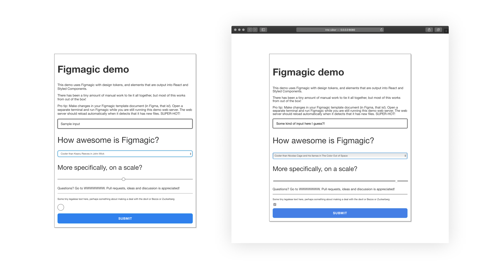
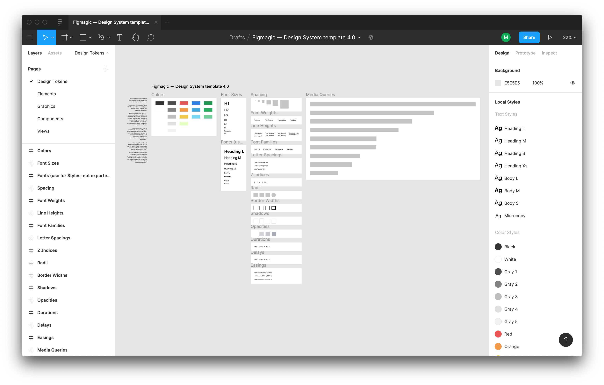
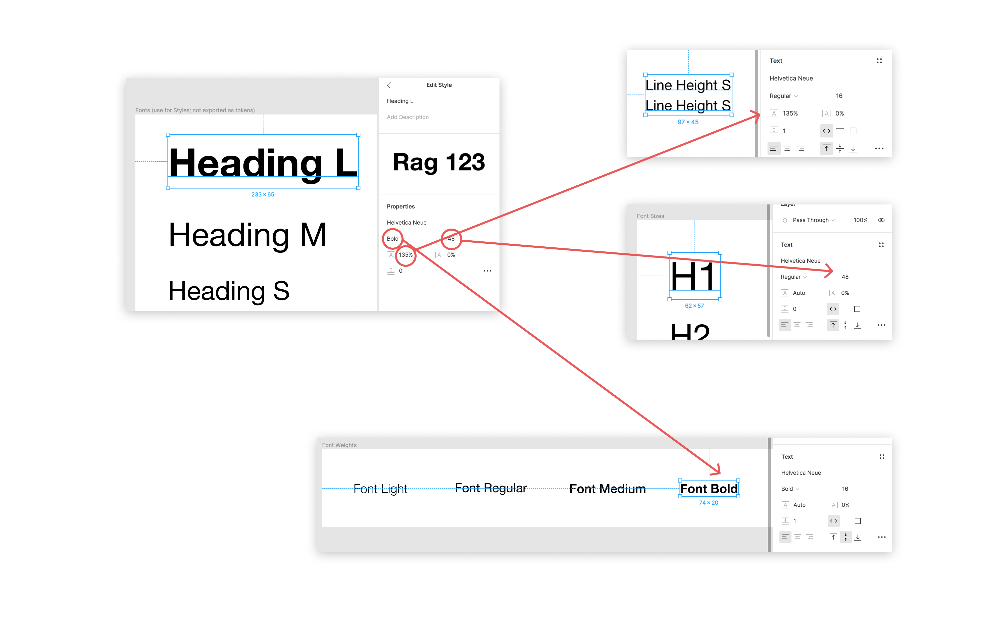

# Figmagic


[](https://sonarcloud.io/dashboard?id=mikaelvesavuori_figmagic)
[](https://deepscan.io/dashboard#view=project&tid=6692&pid=8785&bid=111253)
[](https://codecov.io/gh/mikaelvesavuori/figmagic)
[](https://codeclimate.com/github/mikaelvesavuori/figmagic/maintainability)

#### _Generate design tokens, export graphics, and extract design token-driven React components from your Figma documents. Originally inspired by [Salesforce Theo](https://github.com/salesforce-ux/theo)._

Figmagic promotes a structured way of assembling design systems. Following the primary principle of atomic design, Figmagic wants you to build from the bottom up, beginning with decomposing the tokens. Tokens shape elements, which form components, that are ordered in compositions, which get presented in views... You know the drill, though I am switching Brad Frost's nomenclature into something more front-end friendly.

When it comes to code generation, Figmagic tries to do this in a better way. Instead of over-eagerly promoting hardcoded code generation from huge and complex components, Figmagic tries to competently, or at least "mostly-right", handle automation for things that should not be too context-dependent or manual input-heavy. Code should also be as close to "normal" as possible—meaning that generated code binds values to tokens and not some random px values as other platforms do. All of this can happen because Figmagic assumes a way of working that respects standard CSS and HTML: no magic trickery! Figmagic avoids some of the cognitive and technical overhead by introducing a concept called **Elements**, which are Figmagic-compliant components that can be output into code. By composing larger components out of simple Elements, code generation is made much more manageable while also promoting much more structured design.

Figmagic does not aim at completely removing designers or developers: It just aims to move them closer, while eliminating any of the tedious busywork that has grown around front-end development.

**Please note:** Figmagic requires that your document structure is identical to what I show in the template at [https://www.figma.com/community/file/821094451476848226/Figmagic-%E2%80%94-Design-System-for-Tokens](https://www.figma.com/community/file/821094451476848226/Figmagic-%E2%80%94-Design-System-for-Tokens).

Figmagic is compiled from Typescript to ES6, so you should have Node 10 or later for it to work on your machine.

_Built initially as an internal handoff tool for [Humblebee](https://www.humblebee.se)._

## Example project

An example project—using React, Styled Components and Storybook—is available at [https://github.com/mikaelvesavuori/figmagic-example](https://github.com/mikaelvesavuori/figmagic-example).

Note that this demo is not meant to fully style and do all of the things in the Figma document. I wanted to straddle a middle-of-the-road solution where I did the least work possible to get it working with React and style only a few of the most obvious and helpful elements, like setting disabled state on the button and checkbox.



_Figmagic Example Demo: On the left is a big Figma component assembled of a number of "Elements", Figmagic-compliant components that can be output into code. On the right is the React-composed version of those after just a few minutes of coding and closing elements correctly._

## Using Figmagic

### Installation

#### Global (recommended)

Run `npm install -g figmagic` or `yarn global add figmagic`.

#### Local

Local usage is possible by installing Figmagic as a developer dependency (under `devDependencies`) with `npm install figmagic -D` or `yarn add figmagic -D`, then using a script pointing to the local version, like so:

```
"scripts": {
  "figmagic": "node ./node_modules/figmagic/build/index.js"
}
```

### Create configuration file (.figmagicrc)

Run `figmagic init` to initialize a basic `.figmagicrc` file. As long as you provide your Figma token and document ID/URL, the new generated file is ready to use for Element Sync which can only be done if your configuration points to valid code generation templates (which the generated one does). You'll see that the config will point `templates.templatePath{Graphic|React|Styled|Storybook}` to `./node_modules/figmagic/templates/{graphic|react|styled|story}`. Read more under the [Configuration file section](#configuration-file-figmagicrc).

### Running Figmagic

First of all, get your Figma API token and Figma URL:

- Get your file ID by right-clicking your Figma tab inside of the app and click `Copy Link`—the first, long junk-looking bit is the ID.
- For more on API keys, [go to Figma's developer docs](https://www.figma.com/developers/docs).

Pass in your Figma API token and Figma URL by either:

- Stepping into your project directory (where you want Figmagic to run), and add or replace **FIGMA_URL** and **FIGMA_TOKEN** in a `.env` file with your own file ID (i.e. similar to `821094451476848226`) or full Figma URL (i.e. similar to `https://www.figma.com/file/821094451476848226/Figmagic-%E2%80%94-Design-System-template-4.0`) and API token key.
- Passing in API token and URL through the CLI, like this `figmagic --token {TOKEN} --url {URL}` (substitute curly braces for your actual values)
- Setting them in `.figmagicrc` under `token` and `url`. This is discouraged since you will display these values in clear text and you probably don't want that.

Then:

- Run `figmagic`
- You should now have a folder with the raw JSON dump (default: `/.figmagic`) and a folder with tokens (default: `/tokens`) in the root

#### Overwritten files are moved to trash

When running `figmagic`, files will be moved with the Node module [trash](https://github.com/sindresorhus/trash) (multi-platform) into your OS's trash can. Thus, you can recover anything _unintentionally_ overwritten.

#### Folders

Folder names below follow their default naming. The naming is possible to change via configuration.

- `.figmagic` will contain the extracted JSON retrieved from Figma's API
- `tokens` will contain the token files
- `elements` will contain the generated code
- `graphics` will contain graphics

For a more complete description of the code structure, see the [Code structure section](#code-structure).

## Preparing Figma for Figmagic usage

### Easy solution: Copy the public Figmagic design system template from Figma Community

Go to [https://www.figma.com/community/file/821094451476848226/Figmagic-%E2%80%94-Design-System-for-Tokens](https://www.figma.com/community/file/821094451476848226/Figmagic-%E2%80%94-Design-System-for-Tokens) and make your own copy. Go at it by using the document ID as the **FIGMA_URL** or start copying in your own work.

### Less easy solution: Start from scratch

Your structure needs to correspond to the following:

- A Page needs to exist, called `Design tokens`. Without this page, you can't really do much with Figmagic.
- Further, inside the `Design tokens` page, **frames** need to exist. You can have any number of supported token frame. For starters, name them `Colors`, `Font sizes`, `Font families`, `Font weights`, `Line heights`, and `Spacing` – exact casing is not important, however the **spelling is important!** For a full list of token types, see [the types of design tokens Figmagic can extract](#the-types-of-design-tokens-figmagic-can-extract).
- All items on a page need to be contained within one or more frames.
- Want element syncing? Then create an "Elements" page and place any components there. For the generation to work correctly, you need to stay within the limits specified above.

See a template design system at [https://www.figma.com/community/file/821094451476848226/Figmagic-%E2%80%94-Design-System-template-4.0](https://www.figma.com/community/file/821094451476848226/Figmagic-%E2%80%94-Design-System-template-4.0). Feel free to simply copy-paste it or base your own work around it.

**Note:** Refer to the document structure in the image below and in the template linked above.



_How a Figmagic project could be structured in regards to tokens, if you want to support all currently available token types._

## What are Design Tokens?

Design tokens are the abstract but shared elements from which your design system is built.

Design tokens express any of the individual values that you build from, such as colors, spacing, and typographic features.

Tokens offer a form of “contract” between a designer’s intent and its fulfillment by developers. This means that both sides agree to avoid by all means anything that’s not codified also as a token. For example, avoiding spacing values that are not also available as a token. It’s similar in many ways to old-school styleguides, but tokens should only ever communicate strict, hard values. Styleguides can tend to be context-sensitive and full of explanation—tokens must communicate without context or explanation.

However: You may still want to add written guidance for usage. It’s just that the tokens should be able to be consumed without understanding anything specific about them.

You should bind tokens to Figma styles whenever and wherever possible to simplify your own design work, but make sure that those are also represented in the **Tokens** page, as this page is where a developer will pick up tokens with Figmagic.

### The types of design tokens Figmagic can extract

You can currently extract design tokens for:

- Colors
- Font Sizes
- Spacing
- Font Weights
- Line Heights
- Font Families
- Letter Spacings
- Z Indices
- Radii
- Border Widths
- Shadows (currently supports single/multiple Drop Shadows)
- Opacities
- Durations (for animations)
- Delays (for animations)
- Easing functions (for animations)
- Media Queries

A typical use-case for the generated documents is to feed the extracted values into CSS systems that support external values (such as Styled Components, Emotion, Styled System, any other CSS-in-JS libraries, or maybe even Sass).

## Working with Figmagic as a designer

### Figma styles

Figma styles became publicly available in June 2018 and are incredibly valuable for designers to create single-sources-of-truth when it comes to design values (tokens). When using Figmagic though, the thinking and usage is a bit different from how Figma styles work.

#### Unidimensional or multidimensional values

A Figma style is multidimensional: It contains any number of properties wrapped into one style, acting as kind of a package. This is handy in a design environment and is practical from a user standpoint. The user doesn't have to think too hard about storing "redundant" values that are the same in another component, such as N number of units for line height: They are all taken care of.

Figmagic instead expresses tokens as instances of every individual value, thus being _unidimensional_ – meaning they store only one value per item. Examples could be sets of line heights, font weights, or font sizes, each one individually specified. What this entails for they developer and designer, is that values can be used and mixed as pleased in any number of contexts, not becoming bound to one specific context such as a certain kind of heading. For a developer this is good because we would rather just map out the definitive values for something, onto a component (a "context" so to speak).

Because of this difference, the appropriate way to structure a Figmagic-compatible Figma design document is to display one or more items/tokens in the respective frames that correspond to the accepted token types (line height, font size...) where each item has only one key property that's changed in-between them (such as one text using size 48, the next using size 40...), since those items are what Figmagic loops through when creating your code tokens.

One of the major deviations from this principle is "Fonts" where you can specify more properties than one. However, then those need to individually match other typographical tokens you might have, such as line heights.



_The "Heading L" font token is composed of values that are also represented in the "lesser" uni-dimensional tokens: displayed here are "Line Height S" (135% line height), "H1" (size 48), and "Font Bold" (Bold font style). Setting this font as a Figma Style will make your life as a designer much easier as your apply the text style to things. Auto-generating code with Figmagic will also work just fine, since the individual values are respected._

#### OK, but should I use Figma styles (also) when using Figmagic?

Whatever suits you! As long as you remember that what Figmagic fetches are those single (unidimensional) values from each design item/token it should all work. I've seen that Figma styles make the "contract" between tokens and their day-to-day workflow with designers a lot easier. Again though, Figmagic does not use those values; think of them as a convenient glue.

## Configuring Figmagic

### Token Sync

**By default this is turned on. You will need to have a page named "Design tokens", where your tokens lay within named frames.**

Tokens are the "bread and butter" of Figmagic. Without tokens, Figmagic cannot create elements. And even without elements, tokens provide the core experience to help you run a competent design system with code.

In case you want to skip generating tokens for a given frame, you can just add a leading underscore to the frame name. You can also skip individual items by naming them `ignore` or adding a leading underscore.

This is activated by default, but it's now possible to deactivate it if you have very specific reasons to do so.

### Graphics Sync

**By default this is turned off. Pass in `--syncGraphics` as a flag to sync them or enable that in your configuration file. You will need to have a page named "Graphics", where your components lay directly on the artboard.**

Graphics can be exported in multiple formats with Figmagic. Instead of doing manual hand-overs, just tell your developer(s) that there have been updates to the graphics and let them pull the latest versions from your Figma document.

Again, please look at the template at [https://www.figma.com/community/file/821094451476848226/Figmagic-%E2%80%94-Design-System-for-Tokens](https://www.figma.com/community/file/821094451476848226/Figmagic-%E2%80%94-Design-System-for-Tokens) for reference.

### Element Sync

**This is also turned off by default. Pass in `--syncElements` or enable it in your configuration file to generate code from your Figma components.**

_Upcoming versions of Figmagic may attempt to support [Figma Variants](https://help.figma.com/hc/en-us/articles/360055471353-Prepare-for-Variants), but that will have to be publicly released first, and then vetted against what Figmagic can generate before I commit to supporting that model. Until then, the existing mental model of "Elements" will continue to be used._

Elements are named so because they are primarily meant to help scaffold anything that maps to standard HTML elements like input, button, h1, and form. With scaffolding we mean that these elements can be generated as code in a shape that is fitting for continued development. Elements are a good entry-point both for design and for code generation, since they are relatively simple and as a concept map to HTML, which in turn is based on tags ("elements").

Elements are generated by parsing your structured Figma components into either "flat" or "nested" varieties. Any values, say a height of 48px and a specific blue color, will try to be derived from your relevant tokens. **Therefore, without tokens, elements cannot be generated!** In this example, maybe the height will map to a spacing token that uses 48px (mapping to `3rem` where 3 x 16 = 48, with 16 being the root REM value) and the color might be mapped to a color in your color tokens.

_If you need more information and guidance on this, see the dedicated documentation section at [Figmagic Element Sync](readme/elements.md)._

### How user settings are propagated

There are several ways in which you can provide Figmagic with knowledge about how you want it to parse your tokens.
You can combine them, but beware of the below prioritization chart (from lowest to highest):

1. User-provided configuration from `.figmagicrc` file
2. Environment variables (also loaded from `.env` file using `dotenv`)
3. Command-line arguments and flags

If possible, stick to one way of providing settings.

Non-provided values will fall back to defaults outlined in `bin/entities/Config/baseConfig.ts`.

### Configuration file (`.figmagicrc`)

You can use a JSON-formated configuration file at the root of a project to use its settings. Figmagic will pick up the path by assessing the current working directory and looking for a `.figmagicrc` file there. If it finds it, it will use it.

An example file is provided in Figmagic—you can find it in the root of the project. The file is named `figmagicrc`, just add the leading dot and place the file in your own project folder to use it.

Since this is a configuration file, you'll need to be careful to write it correctly or you may end up with failures and errors.

Below is a complete set of what you can configure, together with the defaults.

```
{
  debugMode: false,
  fontUnit: 'rem',
  letterSpacingUnit: 'em',
  opacitiesUnit: 'float',
  figmaData: 'figma.json',
  figmagicFolder: '.figmagic',
  outputFolderElements: 'elements',
  outputFolderGraphics: 'graphics',
  outputFolderTokens: 'tokens',
  outputFormatCss: 'ts',
  outputFormatDescription: 'md',
  outputFormatElements: 'tsx',
  outputFormatGraphics: 'svg',
  outputFormatStorybook: 'js',
  outputFormatTokens: 'ts',
  outputGraphicElements: false,
  outputGraphicElementsMap: false,
  outputScaleGraphics: 1,
  outputDataTypeToken: null,
  recompileLocal: false,
  remSize: 16,
  skipFileGeneration: {
    forceUpdate: true,
    skipCss: false,
    skipDescription: false,
    skipReact: false,
    skipStorybook: false,
    skipStyled: false
  },
  spacingUnit: 'rem',
  syncElements: false,
  syncGraphics: false,
  syncTokens: true,
  templates: {
    templatePathGraphic: 'templates/graphic',
    templatePathReact: 'templates/react',
    templatePathStorybook: 'templates/story',
    templatePathStyled: 'templates/styled'
  },
  token: '',
  unitlessPrecision: 2,
  url: '',
  usePostscriptFontNames: false
};
```

### CLI arguments

Run these in your command line environment of choice.

#### Toggle debug mode

`figmagic [--debug | -d]`

Default is `false`.

#### Switch font unit

`figmagic [--fontUnit | -fu] [rem|em|px]`

Default is `rem`.

#### Switch letter-spacing unit

`figmagic [--letterSpacingUnit | -lsu] [em|px]`

Default is `em`.

#### Switch opacities unit

`figmagic [--opacitiesUnit | -ou] [float|percent]`

Default is `float`.

#### Set output file name

`figmagic [--figmaData | -file] [filename]`

Default is `figma.json`.

#### Set Figma base file output folder

`figmagic [--figmagicFolder | -base] [folder]`

Default is `.figmagic`.

#### Set elements output folder

`figmagic [--outputFolderElements | -elements] [folder]`

Default is `elements`.

#### Set graphics output folder

`figmagic [--outputFolderGraphics | -graphics] [folder]`

Default is `graphics`.

#### Set token output folder

`figmagic [--outputFolderTokens | -tokens] [folder]`

Default is `tokens`.

#### Switch CSS file format

`figmagic [--outputFormatCss | -fc] [ts|mjs|js]`

Default is `ts`.

#### Switch description file format

`figmagic [--outputFormatDesc | -fd] [md|txt]`

Default is `md`.

#### Switch elements file format

`figmagic [--outputFormatElements | -fe] [tsx|jsx|mjs|js]`

Default is `tsx`.

#### Switch graphics file format

`figmagic [--outputFormatGraphics | -fg] [svg|png]`

Default is `svg`.

#### Switch Storybook file format

`figmagic [--outputFormatStorybook | -fs] [ts|js]`

Default is `js`.

#### Switch token file format

`figmagic [--outputFormatTokens | -ft] [ts|mjs|js|json]`

Default is `ts`.

#### Output graphics as wrapped React elements

`figmagic [--outputGraphicElements | -oge]`

Default is `false`.

#### Output graphics elements map

`figmagic [--outputGraphicElementsMap | -ogm]`

Default is `false`.

#### Set output scale of graphics

`figmagic [--outputScaleGraphics | -scale] [number]`

Default is `1`. **Note that from the CLI you must specify the scale size like `3x` (or anything at the end, as long as it includes letter at the end). This only applies to CLI configuration, and does not apply to other types of config, such as through `.figmagicrc`**.

#### Set output token data type

`figmagic [--outputDataTypeToken | -tokentype] [null | enum]`

Default is `null`. Currently the only valid non-null value is `enum`.

#### Recompile data from local Figma JSON file

`figmagic [--recompileLocal | -local]`

Default is `null`, and will then be taken from local `.env` file if not explicitly passed in through the CLI.

#### Set REM size

`figmagic [--remSize | -rem] [number]`

Default is `16`. **Note that from the CLI you must specify the REM size like `16p` (or anything at the end, as long as it includes letter at the end). This only applies to CLI configuration, and does not apply to other types of config, such as through `.figmagicrc`**.

#### Force update all elements

`figmagic [--forceUpdate | -force]`

Default is `true`. Forces all elements and file types to be regenerated.

#### Skip file generation: CSS

`figmagic [--skipCss | -nocss]`

Default is `false`. Skip creating CSS file when syncing elements.

#### Skip file generation: Markdown description

`figmagic [--skipDescription | -nodesc]`

Default is `false`. Skip creating Markdown file when syncing elements.

#### Skip file generation: React

`figmagic [--skipReact | -noreact]`

Default is `false`. Skip creating React file when syncing elements.

#### Skip file generation: Storybook

`figmagic [--skipStorybook | -nostory]`

Default is `false`. Skip creating Storybook file when syncing elements.

#### Skip file generation: Styled Components

`figmagic [--skipStyled | -nostyled]`

Default is `false`. Skip creating Styled Components file when syncing elements.

#### Switch spacing unit

`figmagic [--spacingUnit | -s] [rem|em]`

Default is `rem`.

#### Sync elements

`figmagic [--syncElements | -se]`

Default is `false`, and will then be taken from local `.env` file if not explicitly passed in through the CLI.

Use this when you want to sync elements in your "Elements" page in Figma.

#### Sync graphics

`figmagic [--syncGraphics | -sg]`

Default is `false`, and will then be taken from local `.env` file if not explicitly passed in through the CLI.

Use this when you want to sync graphics in your "Graphics" page in Figma. Use the RC configuration file to pass in options. Default format will be SVG.

#### Sync tokens

`figmagic [--syncTokens | -st]`

Default is `true`, and will then be taken from local `.env` file if not explicitly passed in through the CLI.

Use this when you want to sync tokens in your "Design tokens" page in Figma. Use the RC configuration file to pass in options.

#### Set path to graphics template

`figmagic [--templatePathGraphic | -tpgraphic] [path]`

Default is `templates/graphic`.

**Your local .figmagicrc file must have a block with `templates.templatePathGraphic` that specifies a valid path, such as `./node_modules/figmagic/templates/graphic`**.

#### Set path to React template

`figmagic [--templatePathReact | -tpreact] [path]`

Default is `templates/react`.

**Your local .figmagicrc file must have a block with `templates.templatePathReact` that specifies a valid path, such as `./node_modules/figmagic/templates/react`**.

#### Set path to Storybook template

`figmagic [--templatePathStorybook | -tpstory] [path]`

Default is `templates/story`.

**Your local .figmagicrc file must have a block with `templates.templatePathStory` that specifies a valid path, such as `./node_modules/figmagic/templates/story`**.

#### Set path to Styled Components template

`figmagic [--templatePathStyled | -tpstyled] [path]`

Default is `templates/styled`.

**Your local .figmagicrc file must have a block with `templates.templatePathStyled` that specifies a valid path, such as `./node_modules/figmagic/templates/styled`**.

#### Pass in Figma API token

`figmagic [--token | -t] [token]`

Default is `null`, and will then be taken from local `.env` file if not explicitly passed in through the CLI.

#### Pass in Figma URL

`figmagic [--url | -u] [url_id]`

Default is `null`, and will then be taken from local `.env` file if not explicitly passed in through the CLI.

#### Pass in unitless precision

`figmagic [--unitlessPrecision | -up] [number]`

Defines the precision (decimals) for unitless values (rounded using `.toFixed()` internally). Default is `2`.

#### Set font family name to be Postscript name instead of "common name"

`figmagic [--usePostscriptFontNames | -ps]`

Default is `false`, i.e. common name.

## Templates used for code generation

Starting with Figmagic version 4.0, four types of generated files have customizable templates:

- Graphic elements
- React elements
- Storybook files
- Styled Components (React) files

These four types have support for a variety of formats that differ a bit between each type.

Figmagic comes with a set of templates for several file formats. In case you want to customize these, you should respect and keep any substitution tags that exist in the original files; removing them may cause your templates to function incorrectly. For example, the React template includes a substitution tag called `{{NAME_STYLED}}` which will be changed to your adjusted element name with a "Styled" suffix. Removing it would make your generated code useless as-is.

The recommended way of adding and using your own templates would be to copy-paste any/all existing templates from Figmagic into your project, pointing the `.figmagicrc` configuration to your local copies, and then modifying them as needed.

## Token formatting and conversions

### Font families

The font family name, either as its common name (as picked up by Figma; spaces are removed) or its Postscript name (eg. FiraSans-Regular).

Default: Common name.

**Note**: In previous versions of Figmagic the Postscript font family name was used.

### Font weights

Typical font weight values like `200`, `300` etc.

### Font sizes

Units based on global font size (base 16px).

Default: `rem` units. Can be set to `rem` or `em`.

### Line heights

Unitless.

2 decimals numbered values by default. Precision can be configured with `unitlessPrecision` (see config)

### Colors

RGBA colors.

### Spacing

Default: `rem` units. Can be set to `rem` or `em`.

### Border widths

Default: `px` units.

### Letter spacings

Default: `em` units.

### Media queries

Default: `px` units.

### Opacities

Typical 2 decimals numbered values between 0 and 1 like `0` or `0.65`.
Can be set to `percent` to have them converted to `%` strings instead like `0%` or `65%`.

### Radii

Default: `px` units.

### Shadows

Default: `px` units for three values (horizontal offset, vertical offset, blur) and RGBA for the color.

### Z indices

Default: numbers (whole numbers, i.e. integers).

## Code structure

### Figmagic source code structure

- `__tests__/`: Tests, structured similarly to the `bin` folder source code
- `.github/`: GitHub files for CI and issue template
- `.vscode/`: Visual Studio Code configuration
- `bin/`: Source code
- `bin/contracts`: Types and interfaces
- `bin/controllers`: Controllers
- `bin/entities`: Entities (DDD-style), this is where most of the logic will be contained
- `bin/frameworks`: Non-domain functionality, like string manipulation and downloading files etc.
- `bin/usecases`: Where the application "features" are orchestrated, as per [Clean Architecture](https://blog.cleancoder.com/uncle-bob/2012/08/13/the-clean-architecture.html)
- `build/`: ES6-compiled code (this is the code that consumers of the Figmagic binary actually use)
- `readme/`: Documentation, mostly images and screen shots
- `templates/`: Files that are used as templates for code generation
- `testdata/`: Most of the tests point to stored test data which is stored in this folder
- `index.ts`: The file that initializes and sets up everything required to run Figmagic

### Arkit map


## Contribution

### Want to add or rethink something in Figmagic?

You are welcome to contribute to the project! Pull requests, as well as issues or plain messages, work fine. For pull requests, please refer to the contribution guidelines in [`CONTRIBUTING.md`](CONTRIBUTING.md).
