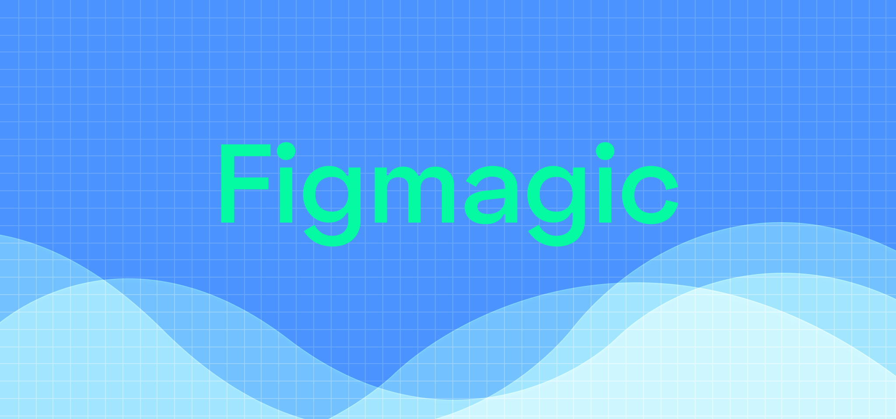
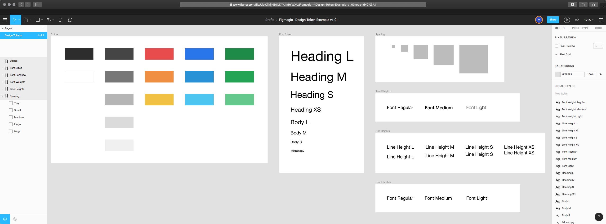

# Figmagic

[](https://travis-ci.org/mikaelvesavuori/figmagic)
[](https://deepscan.io/dashboard#view=project&tid=6692&pid=8785&bid=111253)

Automate the generation of design tokens from your Figma documents. Inspired by [Salesforce Theo](https://github.com/salesforce-ux/theo).

You can currently extract design tokens for:

- Colors
- Font Sizes
- Spacing
- Font Weights
- Line Heights
- Font Families
- Letter Spacings
- Z Indices
- Radii
- Border Widths
- Shadows (currently only supports a single Drop Shadow)
- Media Queries

A typical use-case for the generated documents is to feed the extracted values into CSS systems that support external values (such as Styled Components, Emotion, Styled System, any other CSS-in-JS libraries, or maybe even Sass).

Figmagic uses ESM imports, so make sure you have a recent Node version, preferably version 12.16 or later.

**Please note:** Figmagic requires that your document structure is identical to what I show in the template site at [https://www.figma.com/file/K39TRbltDVcWFlpzw9r7Zh/Figmagic-%E2%80%94-Design-System-for-Tokens?node-id=2605%3A12](https://www.figma.com/file/K39TRbltDVcWFlpzw9r7Zh/Figmagic-%E2%80%94-Design-System-for-Tokens?node-id=2605%3A12). The link shows you the current version `2.1.0` Design System example.

_Built initially as an internal handoff tool for [Humblebee](https://www.humblebee.se)._

## Changes and release notes, version 2 vs version 1

### Improvements

- You can now customize Figmagic a lot more, using both a `.figmagicrc` file and with regular CLI input
- Running `figmagic` with existing tokens will not insta-delete the old files; now they will simply be put in the trash can (this is a requested safety net, for example when you're combining Figmagic with extra steps and hate having files trashed that have changes in them)
- Starting in `2.1.8`, you can also export/sync graphics by passing in the flag `--syncGraphics`
- Clean-up of code, dependency grooming, and better separation into configuration and system files
- Improved documentation and instructions
- More tests and coverage
- [https://www.figmagic.com](https://www.figmagic.com) is launched! Nothing special, but at least creates a bit more visibility

### Changes to keep in mind when migrating

- Spacing is now in `rem` units
- Postscript font family names are no longer used; instead it's the normalized regular names (you can select to use Postscript names if you want, though)

## Approach and use cases

There's a lot to say here about the use cases and approaches taken by other tools. I will be writing an article on the motivations behind the project later on.

The idea of Figmagic is to support an informed handoff between designers and developers. I believe the best way to do this in a solid, mature, and non-impeding way is:

- Expect relative and current value types that are optimally suited for each typology (unitless for line heights, rems for font sizes...). Don't use or expect `px` values in most cases.
- Transform values into a common set of tokens rather than output exact values, ie. use something like `${colors.midGray}` rather than `#3C3C3C`.

## Using Figmagic

### Installation

**Note**: If you get a warning such as `./node_modules/figmagic/index.mjs: line 2: //#: No such file or directory`, this probably only indicates that you have a less recent Node version. Figmagic uses ESM modules so use Node version 13+ and/or provide `node --experimental-modules` as a flag.

#### Global (recommended)

Run `npm install -g figmagic` or `yarn global add figmagic`.

#### Local

Local usage should be possible by installing Figmagic as a devDependency with `npm install figmagic -D` or `yarn add figmagic -D`, then using a script pointing to the local version, like so:

```
"scripts": {
  "figmagic": "node --experimental-modules ./node_modules/figmagic/index.mjs"
}
```

### Running Figmagic

Pass in your Figma API token and Figma URL by either:

- Stepping into your project directory (where you want Figmagic to run), and add or replace **FIGMA_URL** and **FIGMA_TOKEN** in .env with your own file ID and token key (for more on this, [go to Figma's developer docs](https://www.figma.com/developers/docs))
- Passing in API token and URL as per instructions below
- Setting them in `.figmagicrc` under `token` and `url`. This is discouraged since you will display these values in clear text and you probably don't want that

Then:

- Run `figmagic`
- You should now have a folder with the raw JSON dump (default: `/figma`) and a folder with tokens (default: `/tokens`) in the root

#### Overwritten files are moved to trash

When running `figmagic`, files will be moved with the Node module [trash](https://github.com/sindresorhus/trash) (multi-platform) into your OS's trash can. Thus, you can recover anything _unintentionally_ overwritten.

This behavior is a new behavior added since the previous version 1 that destroyed all old files.

## Figma setup

Your structure needs to correspond to the following:

- A Page needs to exist, called "Design tokens". In case you have more than one page, put "Design tokens" as the very first (just in case)
- Further, inside the "Design tokens" page, frames need to be exist. Name them "Colors", "Font sizes", "Font families", "Font weights", "Line heights", and "Spacing" – exact casing is not important, however the **spelling is important!**
- All items on a page need to be contained within one or more frames

See a demo/template at [https://www.figma.com/file/K39TRbltDVcWFlpzw9r7Zh/Figmagic-%E2%80%94-Design-System-for-Tokens?node-id=2605%3A12](https://www.figma.com/file/K39TRbltDVcWFlpzw9r7Zh/Figmagic-%E2%80%94-Design-System-for-Tokens?node-id=2605%3A12). Feel free to simply copy it and paste it into your own document.

**Note:** Refer to the document structure in the image below and in the template linked above.



## Syncing graphics

By default this is turned off. Pass in `--syncGraphics` as a flag to sync them. You will need to have a page named "Graphics", where your components lay directly on the artboard.

Again, please look at the demo/template at [https://www.figma.com/file/K39TRbltDVcWFlpzw9r7Zh/Figmagic-%E2%80%94-Design-System-for-Tokens?node-id=2605%3A12](https://www.figma.com/file/K39TRbltDVcWFlpzw9r7Zh/Figmagic-%E2%80%94-Design-System-for-Tokens?node-id=2605%3A12) for reference.

## Example project

An example project—using React, Webpack and Styled Components—is available at [https://github.com/mikaelvesavuori/figmagic-example](https://github.com/mikaelvesavuori/figmagic-example).

## User settings

There are several ways in which you can provide Figmagic with knowledge about how you want it to parse your tokens. You can combine them, but beware of the below prioritization chart:

1. User-provided configuration from `.figmagicrc` file
2. Command-line arguments and flags
3. Environment variables from `.env` file

If possible, stick to one way of providing settings.

Non-provided values will fall back to defaults outlined in `bin/meta/config.mjs`.

### Configuration file `.figmagicrc`

You can use a JSON-formated configuration file at the root of a project to use its settings. Figmagic will pick up the path by assessing the current working directory and looking at a `.figmagicrc` file there. If it finds it, it will use it.

An example file is provided in Figmagic, it's in the root of the project. The file is named `figmagicrc`, just add the leading dot and place the file in your own project folder to use it.

Below is a complete set of what you can configure, together with the defaults.

```
{
  "debugMode": false,
  "fontUnit": "rem",
  "outputFileName": "figma.json",
  "outputFolderBaseFile": ".figmagic",
  "outputFolderTokens": "tokens",
  "outputTokenFormat": "mjs",
  "outputFolderGraphics": null,
  "outputFormatGraphics": null,
  "outputFolderElements": "elements",
  "recompileLocal": null,
  "spacingUnit": "rem",
  "syncGraphics": null,
  "token": null,
  "url": null,
  "usePostscriptFontNames": false
}
```

### CLI arguments

Run these in your command line environment of choice.

#### Toggle debug mode

`figmagic --debug`

Default is `false`.

#### Recompile data from local Figma JSON file

`figmagic --recompileLocal`

Default is `null`, and will then be taken from local `.env` file if not explicitly passed in through the CLI.

#### Sync graphics

`figmagic --syncGraphics`

Default is `null`, and will then be taken from local `.env` file if not explicitly passed in through the CLI.

Use this when you want to sync graphics in your "Graphics" page in Figma. Use the RC configuration file to pass in options. Default format will be SVG.

#### Switch token file format

`figmagic --outputTokenFormat [mjs|js]||` or `figmagic -tf [mjs|js]`

Default is `mjs`.

#### Switch font unit

`figmagic --fontUnit [rem|em]` or `figmagic -f [rem|em]`

Default is `rem`.

#### Switch spacing unit

`figmagic --spacingUnit [rem|em]` or `figmagic -s [rem|em]`

Default is `rem`.

#### Pass in Figma API token

`figmagic --token [token]` or `figmagic -t [token]`

Default is `null`, and will then be taken from local `.env` file if not explicitly passed in through the CLI.

#### Pass in Figma URL

`figmagic --url [url_id]` or `figmagic -u [url_id]`

Default is `null`, and will then be taken from local `.env` file if not explicitly passed in through the CLI.

#### Set Figma base file output folder

`figmagic --outputFolderBaseFile [folder]` or `figmagic -base [folder]`

Default is `figma`.

#### Set token output folder

`figmagic --outputFolderTokens [folder]` or `figmagic -tokens [folder]`

Default is `tokens`.

#### Set elements output folder

`figmagic --outputFolderElements [folder]` or `figmagic -elements [folder]`

Default is `elements`.

<!--
#### Set components output folder

`figmagic --outputFolderComponents [folder]` or `figmagic -components [folder]`

Default is `components`.
-->

#### Set output file name

`figmagic --outputFileName [filename]` or `figmagic -file [filename]`

Default is `figma.json`.

#### Set font family name to be Postscript name instead of "common name"

`figmagic --usePostscriptFontNames` or `figmagic -ps`

Default is `false`, i.e. common name.

## Figma styles

Figma styles became publicly available in June 2018 and are incredibly valuable for designers to create single-sources-of-truth when it comes to design values (tokens). When using Figmagic though, the thinking and usage is a bit different from how Figma styles work.

### Unidimensional or multidimensional values

A Figma style is multidimensional: It contains any number of properties wrapped into one style, acting as kind of a package. This is handy in a design environment and is practical from a user standpoint. The user doesn't have to think too hard about storing "redundant" values that are the same in another component, such as N number of units for line height: They are all taken care of.

Figmagic instead expresses tokens as instances of every individual value, thus being _unidimensional_ – meaning they store only one value per item. Examples could be sets of line heights, font weights, or font sizes, each one individually specified. What this entails for they developer and designer, is that values can be used and mixed as pleased in any number of contexts, not becoming bound to one specific context such as a certain kind of heading. For a developer this is good because we would rather just map out the definitive values for something, onto a component (a "context" so to speak).

Because of this difference, the appropriate way to structure a Figmagic-compatible Figma design document is to display one or more items/tokens in the respective frames that correspond to the accepted token types (line height, font size...) where each item has only one key property that's changed in-between them (such as one text using size 48, the next using size 40...), since those items are what Figmagic loops through when creating your code tokens.

### OK, but should I use Figma styles (also) when using Figmagic?

Whatever suits you! As long as you remember that what Figmagic fetches are those single (unidimensional) values from each design item/token it should all work. I've seen that Figma styles make the "contract" between tokens and their day-to-day workflow with designers a lot easier. Again though, Figmagic does not use those values; think of them as a convenient glue.

## Token formatting/conversion

### Font families

The font family name, either as its common name (as picked up by Figma; spaces are removed) or its Postscript name (eg. FiraSans-Regular).

Default: Common name.

**Note**: In previous versions of Figmagic the Postscript font family name was used.

### Font weights

Typical font weight values like `200`, `300` etc.

### Font sizes

Units based on global font size (base 16px).

Default: `rem` units. Can be set to `rem` or `em`.

### Line heights

Unitless.

### Colors

RGBA colors.

### Spacing

Default: `rem` units. Can be set to `rem` or `em`.

### Border widths

Default: `px` units.

### Letter spacings

Default: `px` units.

### Media queries

Default: `px` units.

### Radii

Default: `px` units.

### Shadows

Default: `px` units for three values (horizontal offset, vertical offset, blur) and RGBA for the color.

### Z indices

Default: numbers (well, actually, numbers in strings).

## Structure

- `bin/functions`: main functionality
- `bin/meta`: configuration and system texts etc.

Generated:

- `figma` (default folder name) will contain the extracted Figma JSON
- `tokens` (default folder name) will contain the token files (in `.mjs` or `.js` format)

## Planning and roadmap

- `2.1.2`: Output as per Styled System format
- `2.2.0`: Output graphics (SVG or PNG format)
- `2.3.0`: Scaffold components and elements with code templates

## Possible future work items

- Validated Windows support and corresponding Github Actions tasks
- Create "real" JS errors?

## Want to add or rethink something in Figmagic?

You are very welcome to contribute to the project! Pull requests welcome, as well as issues or plain messages.
