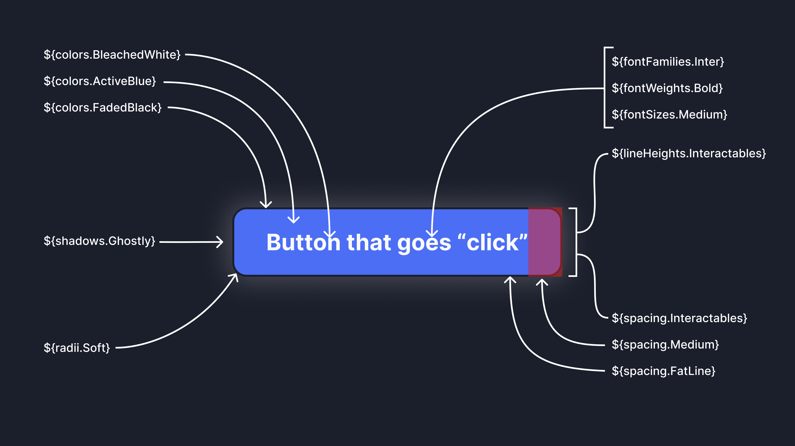
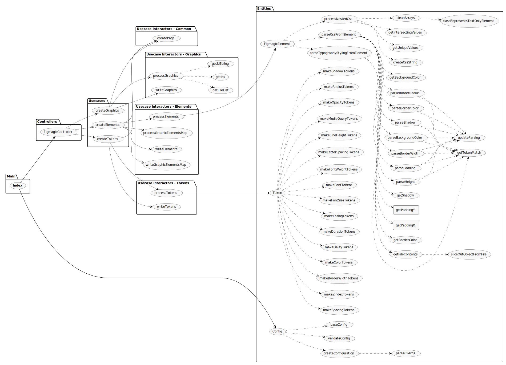

# Figmagic


[](https://sonarcloud.io/dashboard?id=mikaelvesavuori_figmagic)
[](https://codecov.io/gh/mikaelvesavuori/figmagic)
[](https://codeclimate.com/github/mikaelvesavuori/figmagic/maintainability)

> Figmagic is the missing piece between DevOps and design: Generate design tokens, export graphics, and extract design token-driven React components from your Figma documents.

🏕️ Kumbaya, friends. Figmagic automates the world into a better place, but does not attempt to completely remove designers or developers: It just aims to move them closer, while eliminating most of the tedious busywork that has grown around front-end development.

_Built initially as an internal handoff tool for [Humblebee](https://www.humblebee.se)._

---

## PSA: Version `4.3.0` introduces new handling of trashed/replaced files

Previous versions in the 4.0 series have been using [`trash`](https://github.com/sindresorhus/trash) to handle files that need to be replaced. In `4.3.0` this is no longer the case.

Any deleted files are now permanently destroyed by the Node native `fs` module.

**Versions `4.3.0` and `4.3.1` used a flaky dual-mode, configurable pattern where you could use either a "hard" or "soft" delete mode (soft deletes meaning placing files in a local trash folder). _This is NOT supported and intended from `4.3.2` and forward as that was too buggy._**

---

## Requirements

**Please note:** Figmagic requires that your document structure follows the conventions in this document; a full setup can be seen in the template at [https://www.figma.com/community/file/821094451476848226/Figmagic-%E2%80%94-Design-System-for-Tokens](https://www.figma.com/community/file/821094451476848226/Figmagic-%E2%80%94-Design-System-for-Tokens).

Figmagic is compiled from Typescript to ES6, so you should have Node 12 or later (Node 14 and newer recommended) for it to work on your machine.

---

## Introduction

### Figmagic promotes a structured way of assembling design systems

Figmagic is a very straightforward, super-flexible command-line tool that helps you do three things well:

#### 1. Output design tokens

Outputting and using **design tokens** aids in designing with a structured approach. These tokens are completely platform agnostic when output into JSON, or for most web developers, more readily useable in various supported flavors of JavaScript (TS, JS, MJS). It's web-oriented but works well with React Native too.

A basic set of tokens can look like this:

```js
const tokens = {
  colors: {
    blue: 'rgba(20, 20, 255, 1)',
    warmWhite: 'rgba(240, 240, 240, 1)'
  },
  spacing: {
    small: '1rem',
    medium: '1.5rem'
  }
};
```

You use these tokens like so, `color: ${colors.blue};`, to shape and specify your coded components, web sites, apps, and what have you, instead of hard-coding every single value.

**This way, you decouple implementation from data. You can now easily drive changes as _design choices_ through Figma instead of as _code changes_.**

#### 2. Output graphics

Say goodbye to ever manually exporting graphics from Figma again. Grab your graphics as PNG, SVG, as React components with inlined SVG, or as objects that export all graphics from a single file.

#### 3. Generate React components

Figmagic also allows you to generate React components from Figma components that follow a specific formal structure. It's best at fairly low-level components that you can piece together to make more complex organisms on your own. You can significantly cut down on boilerplate churn and scaffolding time with Figmagic.

And, no, the code does not actually suck! This was my own biggest gripe with services promising this functionality, so I knew it had to be good, or at least tolerable. Therefore Figmagic supports things like actually using your own tokens (so we can cut down on hard-coded garbage, unless matches aren't found) and you can completely customize the number of related generated files.

While not perfect, it's definitely better than many things I've seen, made by big companies. All of this is explained later here in the docs.

#### The arguments

Here are a few reasons you'd want to use Figmagic rather than anything similar:

- In Figmagic, design tokens are a first-class concept since day 1
- Figmagic is designer-driven, since Figma is seen as the source of truth
- Figmagic is automatable and very lightweight (~45kb compressed), with no external dependencies
- Figmagic is developer-friendly and makes very few assumptions on your use and/or setup and supports a range of output formats plus that it's extensible through custom templates if you need something completely different
- Figmagic is open-sourced under the MIT license and has a long track record of very short implementation cycles for new features/fixes
- Generated React components bind to any token values you've defined so these are equally useful as starter code or as code you continually output

## Additional documentation sources

The Figmagic developer docs are auto-generated on every push and can be found at the [dedicated documentation site](https://docs.figmagic.com).

For deeper information pertaining to Figmagic Elements and syncing them, see [the dedicated README page](readme/elements.md).

## Example project

An example project—using React, Styled Components and Storybook—is available at [https://github.com/mikaelvesavuori/figmagic-example](https://github.com/mikaelvesavuori/figmagic-example).

Note that this demo is not meant to fully style and do all of the things in the Figma document. I wanted to straddle a middle-of-the-road solution where I did the least work possible to get it working with React and style only a few of the most obvious and helpful elements, like setting disabled state on the button and checkbox.


_Figmagic Example Demo: On the left is a big Figma component assembled of a number of "Elements", Figmagic-compliant components that can be output into code. On the right is the React-composed version of those after just a few minutes of coding and closing elements correctly._

## Using Figmagic

### Installation

#### Global (recommended)

Run `npm install -g figmagic` or `yarn global add figmagic`.

#### Local

Local usage is possible by installing Figmagic as a developer dependency (under `devDependencies`) with `npm install figmagic -D` or `yarn add figmagic -D`, then using a script pointing to the local version, like so:

```
"scripts": {
  "figmagic": "npx figmagic"
}
```

### Create configuration file (`figmagic.json` or `.figmagicrc`)

Figmagic can be run without any configuration. You will always need to specify your Figma API token and Figma document ID, though! However, it's highly recommended to add a configuration: it's easy and gives you a ton of possibilities to optimize for your own needs.

Run `figmagic init` to initialize a basic configuration file, either named `figmagic.json` or `.figmagicrc` file. As long as you provide your Figma token and document ID/URL, the new generated file is ready to use for Element Sync which can only be done if your configuration points to valid code generation templates (which the generated one does). You'll see that the config will point `templates.templatePath{Graphic|React|Styled|Storybook}` to `./node_modules/figmagic/templates/{graphic|react|styled|story}`. Read more under the [Configuration file section](#configuration-file-figmagicrc).

### Running Figmagic

First of all, get your Figma API token and Figma URL:

- Get your file ID by right-clicking your Figma tab inside of the app and click `Copy Link`—the first, long junk-looking bit is the ID.
- For more on API keys, [go to Figma's developer docs](https://www.figma.com/developers/docs).

Pass in your Figma API token and Figma URL by either:

- Stepping into your project directory (where you want Figmagic to run), and add or replace **FIGMA_URL** and **FIGMA_TOKEN** in a `.env` file with your own file ID (i.e. similar to `821094451476848226`) or full Figma URL (i.e. similar to `https://www.figma.com/file/821094451476848226/Figmagic-%E2%80%94-Design-System-template-4.0`) and API token key.
- Passing in API token and URL through the CLI, like this `figmagic --token {TOKEN} --url {URL}` (substitute curly braces for your actual values)
- Setting them in `figmagic.json`/`.figmagicrc` under `token` and `url`. This is discouraged since you will display these values in clear text and you probably don't want that.

Then:

- Run `figmagic`
- You should now have a folder with the raw JSON dump (default: `/.figmagic`) and a folder with tokens (default: `/tokens`) in the root

#### Folders

Folder names below follow their default naming. The naming is possible to change via configuration.

- `.figmagic` will contain the extracted JSON retrieved from Figma's API
- `tokens` will contain the token files
- `elements` will contain the generated code
- `graphics` will contain graphics

For a more complete description of the code structure, see the [Code structure section](#code-structure).

## Preparing Figma for Figmagic usage

### Easy solution: Copy the public Figmagic design system template from Figma Community

Go to [https://www.figma.com/community/file/821094451476848226/Figmagic-%E2%80%94-Design-System-for-Tokens](https://www.figma.com/community/file/821094451476848226/Figmagic-%E2%80%94-Design-System-for-Tokens) and make your own copy. Go at it by using the document ID as the **FIGMA_URL** or start copying in your own work.

### Less easy solution: Start from scratch

Your structure needs to correspond to the following:

- A Page needs to exist, called `Design tokens`. Without this page you can't really do much with Figmagic.
- Further, inside the `Design tokens` page, **frames** need to exist. You can have any number of supported token frame. For starters, name them `Colors`, `Font sizes`, `Font families`, `Font weights`, `Line heights`, and `Spacing` – exact casing is not important, however the **spelling is important!** For a full list of token types, see [the types of design tokens Figmagic can extract](#the-types-of-design-tokens-figmagic-can-extract).
- All items on a page need to be contained within one or more frames.
- Want element syncing? Then create an "Elements" page and place any components there. For the generation to work correctly, you need to stay within the limits specified above.

See a template design system at [https://www.figma.com/community/file/821094451476848226/Figmagic-%E2%80%94-Design-System-template-4.0](https://www.figma.com/community/file/821094451476848226/Figmagic-%E2%80%94-Design-System-template-4.0). Feel free to simply copy-paste it or base your own work around it.

**Note:** Refer to the document structure in the image below and in the template linked above.


_How a Figmagic project could be structured in regards to tokens, if you want to support all currently available token types._

## What are Design Tokens?

Design tokens are the _**abstract and shared elements**_ from which your design system is built.

Design tokens _**express any of the individual values that you build from**_, such as colors, spacing, and typographic features.

Tokens offer a form of “contract” between a designer’s intent and its fulfillment by developers. This means that both sides agree to treat the individual parts of a complete design through the tokens that represent those values. As a format, they are super easy to read and understand and are adaptable for consumption by many types of systems or applications. That’s very important as you start doing cross-platform apps and things like that.



Tokens ensure that values are not [magic numbers](<https://en.wikipedia.org/wiki/Magic_number_(programming)>) or ”just picked at random”. This makes communication precise and effortless. Creating actual code for components, even complex ones, also becomes a lot less of a bore, since what you are doing is just pointing stuff like padding, Z indices, and anything else to their token representations.

_However: You may still want to add written guidance for usage. It’s just that the tokens should be able to be consumed without understanding anything specific about them._

You should bind tokens to Figma styles whenever and wherever possible to simplify your own design work, but make sure that those are also represented in the **Tokens** page, as this page is where a developer will pick up tokens with Figmagic.

### The types of design tokens Figmagic can extract

You can currently extract design tokens for:

- Colors (including linear and radial gradients, though note: linear gradients which are not using straight angles will get an incorrect calculation)
- Font Sizes
- Spacing
- Font Weights
- Line Heights
- Font Families
- Letter Spacings
- Z Indices
- Radii
- Border Widths
- Shadows (currently supports single/multiple Drop Shadows; see caveat below)
- Opacities
- Durations (for animations)
- Delays (for animations)
- Easing functions (for animations)
- Media Queries

A typical use-case for the generated documents is to feed the extracted values into CSS systems that support external values (such as Styled Components, Emotion, Styled System, any other CSS-in-JS libraries, or maybe even Sass).

#### Note on shadows

From [alehar9320](https://github.com/alehar9320) commenting on [issue 111](https://github.com/mikaelvesavuori/figmagic/issues/111):

> Figma calls everything Drop-shadow, while translating the design into box-shadow or drop-shadow CSS dependent upon whether it's a ~ shape or a vector graphic. See [blog post](https://www.figma.com/blog/behind-the-feature-shadow-spread/) from the Figma developer who built the feature.

> This means that if Figmagic is used to define shadow tokens, it should be recommended to only have one drop-shadow definition per rectangle. To maintain compatibility with both drop-shadow and box-shadow CSS. The exception would be if there is a clear distinction between tokens to be used with box-shadow and drop-shadow. As [_drop-shadow_ can only accept a single shadow parameter](<https://developer.mozilla.org/en-US/docs/Web/CSS/filter-function/drop-shadow()>). Any token that has two values will simply be incompatible with drop-shadow.

## Working with Figmagic as a designer

### Figma styles

Figma styles became publicly available in June 2018 and are incredibly valuable for designers to create single-sources-of-truth when it comes to design values (tokens). When using Figmagic though, the thinking and usage is a bit different from how Figma styles work.

#### Unidimensional or multidimensional values

A Figma style is multidimensional: It contains any number of properties wrapped into one style, acting as kind of a package. This is handy in a design environment and is practical from a user standpoint. The user doesn't have to think too hard about storing "redundant" values that are the same in another component, such as N number of units for line height: They are all taken care of.

Figmagic instead expresses tokens as instances of every individual value, thus being _unidimensional_ – meaning they store only one value per item. Examples could be sets of line heights, font weights, or font sizes, each one individually specified. What this entails for they developer and designer, is that values can be used and mixed as pleased in any number of contexts, not becoming bound to one specific context such as a certain kind of heading. For a developer this is good because we would rather just map out the definitive values for something, onto a component (a "context" so to speak).

Because of this difference, the appropriate way to structure a Figmagic-compatible Figma design document is to display one or more items/tokens in the respective frames that correspond to the accepted token types (line height, font size...) where each item has only one key property that's changed in-between them (such as one text using size 48, the next using size 40...), since those items are what Figmagic loops through when creating your code tokens.

One of the major deviations from this principle is "Fonts" where you can specify more properties than one. However, then those need to individually match other typographical tokens you might have, such as line heights.


_The "Heading L" font token is composed of values that are also represented in the "lesser" uni-dimensional tokens: displayed here are "Line Height S" (135% line height), "H1" (size 48), and "Font Bold" (Bold font style). Setting this font as a Figma Style will make your life as a designer much easier as your apply the text style to things. Auto-generating code with Figmagic will also work just fine, since the individual values are respected._

#### OK, but should I use Figma styles (also) when using Figmagic?

Whatever suits you! As long as you remember that what Figmagic fetches are those single (unidimensional) values from each design item/token it should all work. I've seen that Figma styles make the "contract" between tokens and their day-to-day workflow with designers a lot easier. Again though, Figmagic does not use those values; think of them as a convenient glue.

## Configuring Figmagic

### Token Sync

**By default this is turned on. You will need to have a page named "Design tokens", where your tokens lay within named frames.**

Tokens are the "bread and butter" of Figmagic. Without tokens, Figmagic cannot create elements. And even without elements, tokens provide the core experience to help you run a competent design system with code.

In case you want to skip generating tokens for a given frame, you can just add a leading underscore to the frame name. You can also skip individual items by naming them `ignore` or adding a leading underscore.

This is activated by default, but it's now possible to deactivate it if you have very specific reasons to do so.

### Graphics Sync

**By default this is turned off. Pass in `--syncGraphics` as a flag to sync them or enable that in your configuration file. You will need to have a page named "Graphics", where your components lay directly on the artboard.**

Graphics can be exported in multiple formats with Figmagic. Instead of doing manual hand-overs, just tell your developer(s) that there have been updates to the graphics and let them pull the latest versions from your Figma document.

Again, please look at the template at [https://www.figma.com/community/file/821094451476848226/Figmagic-%E2%80%94-Design-System-for-Tokens](https://www.figma.com/community/file/821094451476848226/Figmagic-%E2%80%94-Design-System-for-Tokens) for reference.

### Element Sync

**This is also turned off by default. Pass in `--syncElements` or enable it in your configuration file to generate code from your Figma components.**

_Upcoming versions of Figmagic may attempt to support [Figma Variants](https://help.figma.com/hc/en-us/articles/360055471353-Prepare-for-Variants), but that will have to be publicly released first, and then vetted against what Figmagic can generate before I commit to supporting that model. Until then, the existing mental model of "Elements" will continue to be used._

Elements are named so because they are primarily meant to help scaffold anything that maps to standard HTML elements like input, button, h1, and form. With scaffolding we mean that these elements can be generated as code in a shape that is fitting for continued development. Elements are a good entry-point both for design and for code generation, since they are relatively simple and as a concept map to HTML, which in turn is based on tags ("elements").

Elements are generated by parsing your structured Figma components into either "flat" or "nested" varieties. Any values, say a height of 48px and a specific blue color, will try to be derived from your relevant tokens. **Therefore, without tokens, elements cannot be generated!** In this example, maybe the height will map to a spacing token that uses 48px (mapping to `3rem` where 3 x 16 = 48, with 16 being the root REM value) and the color might be mapped to a color in your color tokens.

_If you need more information and guidance on this, see the dedicated documentation section at [Figmagic Element Sync](images/elements.md)._

### How user settings are propagated

There are several ways in which you can provide Figmagic with knowledge about how you want it to parse your tokens.
You can combine them, but beware of the below prioritization chart (from lowest to highest):

1. User-provided configuration from `figmagic.json`/`.figmagicrc` file
2. Environment variables (also loaded from `.env` file)
3. Command-line arguments and flags

If possible, stick to one way of providing settings.

Non-provided values will fall back to defaults outlined in `bin/entities/Config/baseConfig.ts`.

### Configuration file (`figmagic.json` or `.figmagicrc`)

You can use a JSON-formated configuration file at the root of a project to use its settings. Figmagic will pick up the path by assessing the current working directory and looking for either a `figmagic.json` or `.figmagicrc` file there. If it finds it, it will use it.

An example file is provided in Figmagic—you can find it in the root of the project. The file is named `figmagicrc`, just add the leading dot and place the file in your own project folder to use it. To use it as JSON, add `json` as the file ending.

Since this is a configuration file, you'll need to be careful to write it correctly or you may end up with failures and errors.

Below is a complete set of what you can configure, together with the defaults.

```json5
{
  "debugMode": false,
  "fontUnit": "rem",
  "letterSpacingUnit": "em",
  "lineHeightUnit": "unitless",
  "opacitiesUnit": "float",
  "figmaData": "figma.json",
  "figmagicFolder": ".figmagic",
  "outputFolderElements": "elements",
  "outputFolderGraphics": "graphics",
  "outputFolderTokens": "tokens",
  "outputFormatCss": "ts",
  "outputFormatDescription": "md",
  "outputFormatElements": "tsx",
  "outputFormatGraphics": "svg",
  "outputFormatStorybook": "js",
  "outputFormatTokens": "ts",
  "outputGraphicElements": false,
  "outputGraphicElementsMap": false,
  "outputScaleGraphics": 1,
  "outputDataTypeToken": null,
  "overwrite": {
    "css": false,
    "description": false,
    "graphic": false,
    "react": false,
    "storybook": false,
    "styled": false
  },
  "recompileLocal": false,
  "refreshType": "soft",
  "remSize": 16,
  "skipFileGeneration": {
    "forceUpdate": true,
    "skipCss": false,
    "skipDescription": false,
    "skipReact": false,
    "skipStorybook": false,
    "skipStyled": false
  },
  "spacingUnit": "rem",
  "syncElements": false,
  "syncGraphics": false,
  "syncTokens": true,
  "templates": {
    "templatePathGraphic": "templates/graphic",
    "templatePathReact": "templates/react",
    "templatePathStorybook": "templates/story",
    "templatePathStyled": "templates/styled"
  },
  "token": "",
  "unitlessPrecision": 2,
  "url": "",
  "usePostscriptFontNames": false,
  "versionName": null
};
```

### CLI arguments

Run these in your command line environment of choice.

---

#### Toggle debug mode

`figmagic [--debug | -d]`

**Default**: `false`.

---

#### Switch font unit

`figmagic [--fontUnit | -fu] [rem|em|px]`

**Default**: `rem`.

---

#### Switch letter-spacing unit

`figmagic [--letterSpacingUnit | -lsu] [em|px]`

**Default**: `em`.

---

#### Switch line-height unit

`figmagic [--lineHeightUnit | -lhu] [unitless|em|px|rem]`

**Default**: `unitless`.

---

#### Switch opacities unit

`figmagic [--opacitiesUnit | -ou] [float|percent]`

**Default**: `float`.

---

#### Set output file name

`figmagic [--figmaData | -file] [filename]`

**Default**: `figma.json`.

---

#### Set Figma base file output folder

`figmagic [--figmagicFolder | -base] [folder]`

**Default**: `.figmagic`.

---

#### Set elements output folder

`figmagic [--outputFolderElements | -elements] [folder]`

**Default**: `elements`.

---

#### Set graphics output folder

`figmagic [--outputFolderGraphics | -graphics] [folder]`

**Default**: `graphics`.

---

#### Set token output folder

`figmagic [--outputFolderTokens | -tokens] [folder]`

**Default**: `tokens`.

---

#### Switch CSS file format

`figmagic [--outputFormatCss | -fc] [ts|mjs|js]`

**Default**: `ts`.

---

#### Switch description file format

`figmagic [--outputFormatDesc | -fd] [md|txt]`

**Default**: `md`.

---

#### Switch elements file format

`figmagic [--outputFormatElements | -fe] [tsx|jsx|mjs|js]`

**Default**: `tsx`.

---

#### Switch graphics file format

`figmagic [--outputFormatGraphics | -fg] [svg|png]`

**Default**: `svg`.

---

#### Switch Storybook file format

`figmagic [--outputFormatStorybook | -fs] [ts|js|mdx]`

**Default**: `js`.

---

#### Switch token file format

`figmagic [--outputFormatTokens | -ft] [ts|mjs|js|json]`

**Default**: `ts`.

---

#### Output graphics as wrapped React elements

`figmagic [--outputGraphicElements | -oge]`

**Default**: `false`.

---

#### Output graphics elements map

`figmagic [--outputGraphicElementsMap | -ogm]`

**Default**: `false`.

---

#### Set output scale of graphics

`figmagic [--outputScaleGraphics | -scale] [number]`

**Default**: `1`.

_Note that from the CLI you must specify the scale size like `3x` (or anything at the end, as long as it includes letter at the end). This only applies to CLI configuration, and does not apply to other types of config, such as through `figmagic.json` or `.figmagicrc`_.

---

#### Set output token data type

`figmagic [--outputDataTypeToken | -tokentype] [null | enum]`

**Default**: `null`.

---

#### Overwrite files

This is not currently possible to adjust from the CLI.

---

#### Recompile data from local Figma JSON file

`figmagic [--recompileLocal | -local]`

**Default**: `null`, and will then be taken from local `.env` file if not explicitly passed in through the CLI.

---

#### Set REM size

`figmagic [--remSize | -rem] [number]`

**Default**: `16`.

_Note that from the CLI you must specify the REM size like `16p` (or anything at the end, as long as it includes letter at the end). This only applies to CLI configuration, and does not apply to other types of config, such as through `figmagic.json` or `.figmagicrc`_.

---

#### Force update all elements

`figmagic [--forceUpdate | -force]`

**Default**: `true`.

Forces all elements and file types to be regenerated.

---

#### Skip file generation: CSS

`figmagic [--skipCss | -nocss]`

**Default**: `false`.

Skip creating CSS file when syncing elements.

---

#### Skip file generation: Markdown description

`figmagic [--skipDescription | -nodesc]`

**Default**: `false`.

Skip creating Markdown file when syncing elements.

---

#### Skip file generation: React

`figmagic [--skipReact | -noreact]`

**Default**: `false`.

Skip creating React file when syncing elements.

---

#### Skip file generation: Storybook

`figmagic [--skipStorybook | -nostory]`

**Default**: `false`.

Skip creating Storybook file when syncing elements.

---

#### Skip file generation: Styled Components

`figmagic [--skipStyled | -nostyled]`

**Default**: `false`.

Skip creating Styled Components file when syncing elements.

---

#### Switch spacing unit

`figmagic [--spacingUnit | -s] [rem|em|px]`

**Default**: `rem`.

---

#### Sync elements

`figmagic [--syncElements | -se]`

**Default**: `false`, and will then be taken from local `.env` file if not explicitly passed in through the CLI.

Use this when you want to sync elements in your "Elements" page in Figma.

---

#### Sync graphics

`figmagic [--syncGraphics | -sg]`

**Default**: `false`, and will then be taken from local `.env` file if not explicitly passed in through the CLI.

Use this when you want to sync graphics in your "Graphics" page in Figma. Use the RC configuration file to pass in options. Default format will be SVG.

---

#### Sync tokens

`figmagic [--syncTokens | -st]`

**Default**: `true`, and will then be taken from local `.env` file if not explicitly passed in through the CLI.

Use this when you want to sync tokens in your "Design tokens" page in Figma. Use the RC configuration file to pass in options.

---

#### Set path to graphics template

`figmagic [--templatePathGraphic | -tpgraphic] [path]`

**Default**: `templates/graphic`.

_Your local `figmagic.json` or `.figmagicrc` file must have a block with `templates.templatePathGraphic` that specifies a valid path, such as `./node_modules/figmagic/templates/graphic`_.

---

#### Set path to React template

`figmagic [--templatePathReact | -tpreact] [path]`

**Default**: `templates/react`.

_Your local `figmagic.json` or `.figmagicrc` file must have a block with `templates.templatePathReact` that specifies a valid path, such as `./node_modules/figmagic/templates/react`_.

---

#### Set path to Storybook template

`figmagic [--templatePathStorybook | -tpstory] [path]`

**Default**: `templates/story`.

_Your local `figmagic.json` or `.figmagicrc` file must have a block with `templates.templatePathStory` that specifies a valid path, such as `./node_modules/figmagic/templates/story`_.

---

#### Set path to Styled Components template

`figmagic [--templatePathStyled | -tpstyled] [path]`

**Default**: `templates/styled`.

_Your local `figmagic.json` or `.figmagicrc` file must have a block with `templates.templatePathStyled` that specifies a valid path, such as `./node_modules/figmagic/templates/styled`_.

---

#### Pass in Figma API token

`figmagic [--token | -t] [token]`

**Default**: `null`, and will then be taken from local `.env` file if not explicitly passed in through the CLI.

---

#### Set relative import path for tokens (for CSS)

`figmagic [--tokensRelativeImportPrefix | -tip] [path]`

**Default**: `''` (effectively just blank or the same folder). Use this so CSS files can import tokens from the correct location, for example to resolve something like `../../tokens/colors.ts` you would pass in `../../` and `tokens` would be whatever your `outputFolderTokens` value is.

---

#### Pass in Figma URL

`figmagic [--url | -u] [url_id]`

**Default**: `null`, and will then be taken from local `.env` file if not explicitly passed in through the CLI.

---

#### Pass in unitless precision

`figmagic [--unitlessPrecision | -up] [number]`

**Default**: `2`.

Defines the precision (decimals) for unitless values (rounded using `.toFixed()` internally).

---

#### Set font family name to be Postscript name instead of "common name"

`figmagic [--usePostscriptFontNames | -ps]`

**Default**: `false`, i.e. common name.

---

#### Use a versioned Figma document

`figmagic [--versionName | -v]`

**Default**: `null` which will resolve to the latest version. The value you specify here is the name of the version in the Figma file's **Version history**.

---

## Templates used for code generation

Starting with Figmagic version 4.0, four types of generated files have customizable templates:

- Graphic elements
- React elements
- Storybook files
- Styled Components (React) files

These four types have support for a variety of formats that differ a bit between each type.

Figmagic comes with a set of templates for several file formats. In case you want to customize these, you should respect and keep any substitution tags that exist in the original files; removing them may cause your templates to function incorrectly. For example, the React template includes a substitution tag called `{{NAME_STYLED}}` which will be changed to your adjusted element name with a "Styled" suffix. Removing it would make your generated code useless as-is.

The recommended way of adding and using your own templates would be to copy-paste any/all existing templates from Figmagic into your project, pointing the configuration file to your local copies, and then modifying them as needed.

## Token formatting and conversions

### Font families

The font family name, either as its common name (as picked up by Figma; spaces are removed) or its Postscript name (eg. FiraSans-Regular).

**Default:** Common name.

**Note**: In previous versions of Figmagic the Postscript font family name was used.

---

### Font weights

Typical font weight values like `200`, `300` etc.

---

### Font sizes

Units based on global font size (base 16px).

**Default:** `rem` units. Can be set to `rem` or `em`.

---

### Line heights

Unitless.

2 decimals numbered values by default. Precision can be configured with `unitlessPrecision` (see config)

---

### Colors

RGBA colors.

---

### Spacing

**Default:** `rem` units. Can be set to `rem` or `em`.

---

### Border widths

**Default:** `px` units.

---

### Letter spacings

**Default:** `em` units.

---

### Media queries

**Default:** `px` units.

---

### Opacities

Typical 2 decimals numbered values between 0 and 1 like `0` or `0.65`.
Can be set to `percent` to have them converted to `%` strings instead like `0%` or `65%`.

---

### Radii

**Default:** `px` units.

---

### Shadows

**Default:** `px` units for three values (horizontal offset, vertical offset, blur) and RGBA for the color.

---

### Z indices

**Default:** numbers (whole numbers, i.e. integers).

---

## Code structure

### Figmagic source code structure

| Folder            | Description                                                                                                                                                  |
| ----------------- | ------------------------------------------------------------------------------------------------------------------------------------------------------------ |
| `__tests__/`      | Tests, structured similarly to the `bin` folder source code                                                                                                  |
| `.github/`        | GitHub files for CI and issue template                                                                                                                       |
| `.husky/`         | Husky pre-commit configuration                                                                                                                               |
| `.vscode/`        | Visual Studio Code configuration                                                                                                                             |
| `bin/`            | Source code                                                                                                                                                  |
| `bin/contracts`   | Types and interfaces                                                                                                                                         |
| `bin/controllers` | Controllers                                                                                                                                                  |
| `bin/entities`    | Entities (DDD-style), this is where most of the logic will be contained                                                                                      |
| `bin/frameworks`  | Non-domain functionality, like string manipulation and downloading files etc.                                                                                |
| `bin/usecases`    | Where the application "features" are orchestrated, as per [Clean Architecture](https://blog.cleancoder.com/uncle-bob/2012/08/13/the-clean-architecture.html) |
| `build/`          | ES6-compiled code (this is the code that consumers of the Figmagic binary actually use)                                                                      |
| `images/`         | Documentation, mostly images and screen shots                                                                                                                |
| `readme/`         | Additional readme files                                                                                                                                      |
| `templates/`      | Files that are used as templates for code generation                                                                                                         |
| `testdata/`       | Most of the tests point to stored test data which is stored in this folder                                                                                   |
| `typedoc-docs/`   | Documentation generated by TypeDoc; gets hosted at [https://docs.figmagic.com](https://docs.figmagic.com)                                                    |
| `index.ts`        | The file that initializes and sets up everything required to run Figmagic                                                                                    |

### Arkit diagram

This is how [Arkit](https://arkit.pro) models Figmagic and its source code structure and dependencies. Note that this diagram omits frameworks, external dependencies and contracts (i.e. types) to focus on the primary flows.



## Contribution

### Want to add or rethink something in Figmagic?

You are welcome to contribute to the project! Pull requests, as well as issues or plain messages, work fine. For pull requests, please refer to the contribution guidelines in [`CONTRIBUTING.md`](CONTRIBUTING.md).
