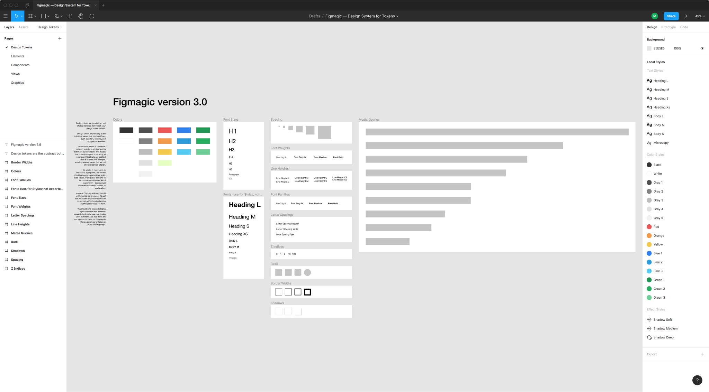
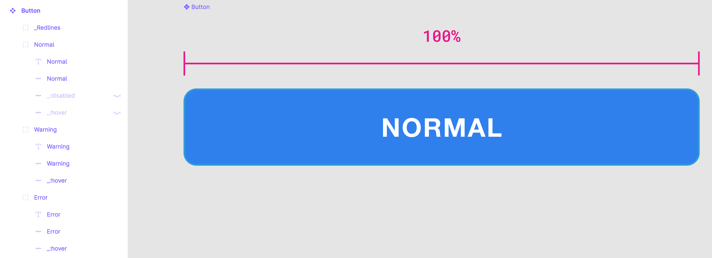
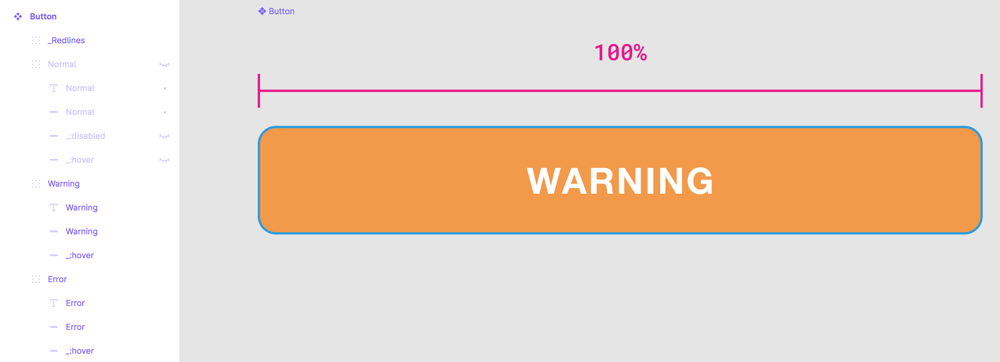
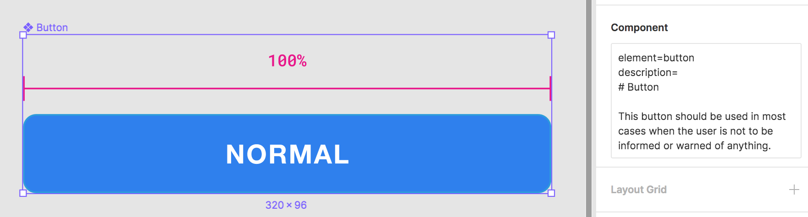
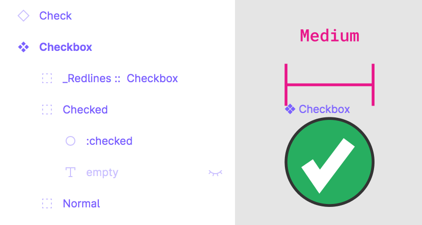
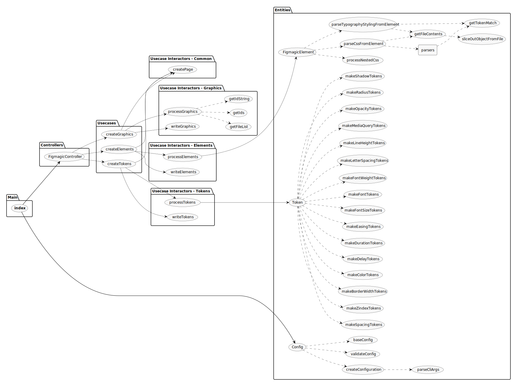

# Figmagic

[](https://travis-ci.org/mikaelvesavuori/figmagic)
[](https://deepscan.io/dashboard#view=project&tid=6692&pid=8785&bid=111253)
[](https://codecov.io/gh/mikaelvesavuori/figmagic)
[](https://codeclimate.com/github/mikaelvesavuori/figmagic/maintainability)
[](https://codeclimate.com/github/mikaelvesavuori/figmagic/test_coverage)

Generate design tokens, export graphics, and extract design token-driven React components from your Figma documents. Inspired by [Salesforce Theo](https://github.com/salesforce-ux/theo).

Figmagic promotes a structured way of assembling design systems. Following the primary principle of atomic design, Figmagic wants you to build from the bottom up, beginning with decomposing the tokens. Tokens shape elements, which form components, that are ordered in compositions, which get presented in views... You know the drill, though I am switching Brad Frost's nomenclature into something more front-end friendly.

When it comes to code generation, Figmagic tries to do this in a better way. Instead of over-eagerly promoting hardcoded code generation from huge and complex components, Figmagic tries to competently, or at least "mostly-right", handle automation for things that should not be too context-dependent or manual input-heavy. Code should also be as close to "normal" as possible—meaning that generated code binds values to tokens and not some random px values as other platforms do. All of this can happen because Figmagic assumes a way of working that respects standard CSS and HTML: no magic trickery! Figmagic avoids some of the cognitive and technical overhead by introducing a concept called **Elements**, which are Figmagic-compliant components that can be output into code. By composing larger components out of simple Elements, code generation is made much more manageable while also promoting much more structured design.

Figmagic does not aim at completely removing designers or developers: It just aims to move them closer, while eliminating any of the tedious busywork that has grown around front-end development.

**Please note:** Figmagic requires that your document structure is identical to what I show in the template at [https://www.figma.com/community/file/821094451476848226/Figmagic-%E2%80%94-Design-System-for-Tokens](https://www.figma.com/community/file/821094451476848226/Figmagic-%E2%80%94-Design-System-for-Tokens).

Figmagic uses ESM imports, so make sure you have a recent Node version, preferably version 12.16 or later.

_Built initially as an internal handoff tool for [Humblebee](https://www.humblebee.se)._

## Example project

An example project—using React, Styled Components and Storybook—is available at [https://github.com/mikaelvesavuori/figmagic-example](https://github.com/mikaelvesavuori/figmagic-example).

Note that this demo is not meant to fully style and do all of the things in the Figma document. I wanted to straddle a middle-of-the-road solution where I did the least work possible to get it working with React and style only a few of the most obvious and helpful elements, like setting disabled state on the button and checkbox.


_Figmagic Example Demo: On the left is a big Figma component assembled of a number of "Elements", Figmagic-compliant components that can be output into code. On the right is the React-composed version of those after just a few minutes of coding and closing elements correctly._

## Changes and release notes

### Major changes from version 2 > 3

- Experimental support for "Element Sync": Auto-generate code from your Figma components (out-of-the-box support for React, Styled Components and Storybook). Since this is still early days, and because adequate generation requires certain rigor, you will maybe need to adapt some of your Figma manners for this to work. Please see "What you should know before using element sync" below, and so also take the time to look at the updated Figmagic template.
- Base folder for Figma JSON is now `.figmagic/`; was previously `figma/`
- Extended documentation, both on new features and cleaning up of old content and structure
- More testing, more bug fixes, code quality improvements and the usual under-the-hood things.

### Major changes from version 1 > 2

- You can now customize Figmagic a lot more, using both a `.figmagicrc` file and regular CLI input
- Running `figmagic` with existing tokens will not insta-delete the old files; now they will simply be put in the trash can (this is a requested safety net, for example when you're combining Figmagic with extra steps and hate having files trashed that have changes in them)
- Starting in `2.1.8`, you can also export/sync graphics by passing in the flag `--syncGraphics`
- Clean-up of code, dependency grooming, and better separation into configuration and system files
- Improved documentation and instructions
- More tests and coverage
- [https://www.figmagic.com](https://www.figmagic.com) is launched! Nothing special, but at least creates a bit more visibility
- **Changes to keep in mind when migrating from version 1**: Spacing is now in `rem` units, and Postscript font family names are no longer used; instead it's the normalized regular names (you can select to use Postscript names if you want, though)

## Using Figmagic

### Installation

**Note**: If you get a warning such as `./node_modules/figmagic/index.mjs: line 2: //#: No such file or directory`, this probably only indicates that you have a less recent Node version. Figmagic uses ESM modules so use Node version 13+ and/or provide `node --experimental-modules` as a flag.

#### Global (recommended)

Run `npm install -g figmagic` or `yarn global add figmagic`.

#### Local

Local usage should be possible by installing Figmagic as a devDependency with `npm install figmagic -D` or `yarn add figmagic -D`, then using a script pointing to the local version, like so:

```
"scripts": {
  "figmagic": "node --experimental-modules ./node_modules/figmagic/index.mjs"
}
```

### Recommended: Create configuration file (.figmagicrc)

This is the best way to get going if you want to do Element Sync, in which case **you must explicitly add a block to your `.figmagicrc` file, pointing `templates.templatePath{React|Styled|Storybook}` to `./node_modules/figmagic/templates/{react.jsx|styled.jsx|story.js}`**. Read more under the **User Settings** section.

### Running Figmagic

First of all, get your Figma API token and Figma URL:

- Get your file ID by right-clicking your Figma tab inside of the app and click `Copy Link`—the first, long junk-looking bit is the ID.
- For more on API keys, [go to Figma's developer docs](https://www.figma.com/developers/docs).

Pass in your Figma API token and Figma URL by either:

- Stepping into your project directory (where you want Figmagic to run), and add or replace **FIGMA_URL** and **FIGMA_TOKEN** in .env with your own file ID and API token key.
- Passing in API token and URL through the CLI, like this `figmagic --token {TOKEN} --url {URL}` without the curly braces
- Setting them in `.figmagicrc` under `token` and `url`. This is discouraged since you will display these values in clear text and you probably don't want that.

Then:

- Run `figmagic`
- You should now have a folder with the raw JSON dump (default: `/.figmagic`) and a folder with tokens (default: `/tokens`) in the root

#### Overwritten files are moved to trash

When running `figmagic`, files will be moved with the Node module [trash](https://github.com/sindresorhus/trash) (multi-platform) into your OS's trash can. Thus, you can recover anything _unintentionally_ overwritten.

This behavior is a new behavior added since the previous version 1 that destroyed all old files.

#### Folders

- `.figmagic` (default folder name) will contain the extracted Figma JSON
- `tokens` (default folder name) will contain the token files (in `.mjs` or `.js` format)
- `elements` (default folder name) will contain the generated code (in `.jsx` or `.js` format)
- `graphics` (default folder name) will contain graphics (in `.svg`, `.jpg` or `.png` format)

## Figma setup

### Easy solution: Copy the public Figma template

Go to [https://www.figma.com/community/file/821094451476848226/Figmagic-%E2%80%94-Design-System-for-Tokens](https://www.figma.com/community/file/821094451476848226/Figmagic-%E2%80%94-Design-System-for-Tokens) and make your own copy. Go at it by using the document ID as the **FIGMA_URL** or start copying in your own work.

### Less easy solution: Start from scratch

Your structure needs to correspond to the following:

- A Page needs to exist, called `Design tokens`. Without this page, you can't really do much with Figmagic.
- Further, inside the `Design tokens` page, **frames** need to exist. Name them `Colors`, `Font sizes`, `Font families`, `Font weights`, `Line heights`, and `Spacing` – exact casing is not important, however the **spelling is important!**
- All items on a page need to be contained within one or more frames.
- Want element syncing? Then create an "Elements" page and place any components there. For the generation to work correctly, you need to stay within the limits specified above.

See a template design system at [https://www.figma.com/community/file/821094451476848226/Figmagic-%E2%80%94-Design-System-for-Tokens](https://www.figma.com/community/file/821094451476848226/Figmagic-%E2%80%94-Design-System-for-Tokens). Feel free to simply copy-paste it or base your own work around it.

**Note:** Refer to the document structure in the image below and in the template linked above.



_How a Figmagic project should be structured in regards to tokens_

## Design Tokens

Design tokens are the abstract but shared elements from which your design system is built.

Design tokens express any of the individual values that you build from, such as colors, spacing, and typographic features.

Tokens offer a form of “contract” between a designer’s intent and its fulfillment by developers. This means that both sides agree to avoid by all means anything that’s not codified also as a token. For example, avoiding spacing values that are not also available as a token. It’s similar in many ways to old-school styleguides, but tokens should only ever communicate strict, hard values. Styleguides can tend to be context-sensitive and full of explanation—tokens must communicate without context or explanation.

However: You may still want to add written guidance for usage. It’s just that the tokens should be able to be consumed without understanding anything specific about them.

You should bind tokens to Figma styles whenever and wherever possible to simplify your own design work, but make sure that those are also represented in the **Tokens** page, as this page is where a developer will pick up tokens with Figmagic.

You can currently extract design tokens for:

- Colors
- Font Sizes
- Spacing
- Font Weights
- Line Heights
- Font Families
- Letter Spacings
- Z Indices
- Radii
- Border Widths
- Shadows (currently supports single/multiple Drop Shadows)
- Media Queries
- Opacities
- Durations (for animations)
- Delays (for animations)
- Easing functions (for animations)

A typical use-case for the generated documents is to feed the extracted values into CSS systems that support external values (such as Styled Components, Emotion, Styled System, any other CSS-in-JS libraries, or maybe even Sass).

## Graphics Sync

**By default this is turned off. Pass in `--syncGraphics` as a flag to sync them. You will need to have a page named "Graphics", where your components lay directly on the artboard.**

Graphics can be exported in multiple formats with Figmagic. Instead of doing manual hand-overs, just tell your developer(s) that there have been updates to the graphics and let them pull the latest versions from your Figma document.

Again, please look at the template at [https://www.figma.com/community/file/821094451476848226/Figmagic-%E2%80%94-Design-System-for-Tokens](https://www.figma.com/community/file/821094451476848226/Figmagic-%E2%80%94-Design-System-for-Tokens) for reference.

## Element Sync

**This is also turned off by default. Pass in `--syncElements` to generate code from your Figma components.**

Elements are named so because they are primarily meant to help scaffold anything that maps to standard HTML elements like input, button, h1, and form. With scaffolding we mean that these elements can be generated as code in a shape that is fitting for continued development. Elements are a good entrypoint both for design and for code generation, since they are relatively simple and as a concept map to HTML which is based on using tags ("elements").

Figmagic assumes that an element can have **typography** and **layout**. These are communicated through a text-layer (for typography) and a non-text layer (such as a styled rectangle) for layout.

You can do simple **flat** elements or **nested** ones, where you want “stateful” behavior like being invalid or disabled. Open and inspect some of the elements in the [Figmagic template]() to see both patterns! You can make nested elements as deep as you want, but Figmagic will currently only generate code based on the first nesting layer. If making a nested element, code will be generated according to one subclass per nested group.



_Nesting: Button. "Normal" state. Notice how the underscore is blocking ":disabled" and ":hover"._



_Nesting: Button. "Warning" state._


_Nesting: Button. "Error" state._


_Nesting: Generated code. Notice how the nested group names became CSS classes. Only the differences in those layers were promoted to their own class, eliminating redundant code._

You can prefix with `:` to set/communicate a pseudo-selector (like `:hover`) during code generation and `_` (underscore) which will make anything prefixed with that ignored during the generation step.

Further description and element choice is made in the right-hand side Description panel. Click an element in the Figmagic template to see how various elements are set up.

As the scaffolding is experimental you should pay attention to the expected Figma structure for it to work. Expect that many things are still unsupported (such as images) for now.

You should definitely still continue to layout your elements/components as they should look in their final state, but understand that the output is likely not 100% complete right after generation, nor will it always work if you do anything unsupported.

**Pro tip**: Use a plugin like [Figma Redlines](https://www.figma.com/resources/assets/figma-redlines/) to communicate hard-to-see tokens/features like the padding inside of an Input element. Don’t forget to add a prefixing `_` so Figmagic can safely ignore the redlines.

### Details and what to know about Element Sync

- On the first generation (when Figmagic does not find anything in your element output folder) it will normally generate all 5 file types (React, Storybook, Styled Components, CSS, Markdown description). When updating, it will not normally regenerate the React, Storybook or Styled Components file. This is to ensure that they have stability and that you don't risk anything when you pull fresh.
- You can write `element=`, `type=`, `placeholder=` in Figma's component description field to set those values in the generated HTML. Type and placeholder becomes React properties, and element defines the actual element type.



_Setting what the Figma component ("element", in Figmagic terms as far as we are interested) should generate in HTML terms. Also, notice how we are typing out the description for our Markdown file which can be used in, for example, Storybook._

- You can provide your own templates through `.figmagicrc` or the CLI; for expected shape see `/templates` in the Figmagic source code.
- You can skip code generation for any of the 5 generated file types through CLI or `.figmagicrc`.
- You can pass in `--forceUpdate` to force all generated files to be updated.

For specifics on how to do any CLI or RC file configuration, see documentation below.


_How a Figmagic project could be structured with elements_

### Element Sync is still experimental! Caveats, issues and gotchas

First and foremost:



_Element Sync will not solve all of your issues and you will have to creatively work around some of the current limitations in Figmagic. For example, in the case above the check is not in the actual component, as it would not be correctly picked up by Figmagic. In this case, we want to communicate design and intent to developers, but not break the code, thus moving the check out and leaving the rest in. That should solve a lot of the boilerplate work, at least, but the check needs to be added manually afterwards. Assume that you will always need to do some work! Just that it should be a lot less than without Figmagic :)_

- **Known issue**: Sometimes element syncing will fail. Sorry! It's just how it is. Try again, or maybe a couple of times, and it should be resolved. This seems to be because of some async operation that's still not 100%.
- JS/MJS format can be set for CSS and tokens, the other types have hardcoded formats for now.
- CSS class name will be taken from the layout element's name. Same story for pseudo-element naming (such as ”:checked”).
- Flat (non-nested) elements should have the layout element using the Component name (such as ”Slider”), else it will fail.


_Flat elements should be enough for most basic use cases. Don't forget to name the layout layer to the same name as your Figma component or it will break during generation!_

- Don’t use more than one object with a fill in an element (you will get only one background/background-color!).
- Elements are not self-closing (i.e. they are always `<element></element>` rather than `<element />`).
- Cannot combine groups AND flat/non-nested styling inside an element.
- Linear gradient is supported, but it does not use ”gradientHandlePositions”.

#### Nested components

- CSS output can be wonky if you don’t use at least 2 different ”variants” or ”states” in your nested component — use regular non-nested components/elements when you don’t actually have multiple variants.
- Layer order matters in nested elements! It will always pick the first layout or text element it finds.
- Currently only a single layout element per group/nested layer will be picked up.


_As of version 3.0, having more than one layout element in the same nesting group will conflict. Try to use a pattern where non-standard layout is blocked from code generation with an underscore._


_Prefixing with an underscore means we can avoid the conflict, but still clearly communicate intended behavior and style._

- Nested elements should have a text element in order to avoid breaking or getting strange CSS/behavior. This layer does not have to be visible!
- Nested elements require that you only have Groups in the base of the element.

#### Incomplete list of things that are not yet supported

- Gradients (only Linear Gradient for now)
- Easing
- Layout constraints
- Layout grid
- Images
- Blend modes

## User settings

There are several ways in which you can provide Figmagic with knowledge about how you want it to parse your tokens.
You can combine them, but beware of the below prioritization chart (from lowest to highest):

1. User-provided configuration from `.figmagicrc` file
2. Environment variables (also loaded from `.env` file using `dotenv`)
3. Command-line arguments and flags

If possible, stick to one way of providing settings.

Non-provided values will fall back to defaults outlined in `bin/meta/config.mjs`.

### Configuration file `.figmagicrc`

You can use a JSON-formated configuration file at the root of a project to use its settings. Figmagic will pick up the path by assessing the current working directory and looking at a `.figmagicrc` file there. If it finds it, it will use it.

An example file is provided in Figmagic—you can find it in the root of the project. The file is named `figmagicrc`, just add the leading dot and place the file in your own project folder to use it.

Below is a complete set of what you can configure, together with the defaults.

```
export const baseConfig: Config = {
  debugMode: false,
  fontUnit: 'rem',
  letterSpacingUnit: 'em',
  opacitiesUnit: 'float',
  figmaData: 'figma.json',
  figmagicFolder: '.figmagic',
  outputFolderElements: 'elements',
  outputFolderGraphics: 'graphics',
  outputFolderTokens: 'tokens',
  outputFormatGraphics: 'svg',
  outputScaleGraphics: 1,
  outputDataTypeToken: null,
  outputFormatTokens: 'mjs',
  recompileLocal: false,
  remSize: 16,
  skipFileGeneration: {
    forceUpdate: true,
    skipCss: false,
    skipDescription: false,
    skipReact: false,
    skipStorybook: false,
    skipStyled: false
  },
  spacingUnit: 'rem',
  syncElements: false,
  syncGraphics: false,
  templates: {
    templatePathReact: 'templates/react',
    templatePathStorybook: 'templates/story',
    templatePathStyled: 'templates/styled'
  },
  token: '',
  url: '',
  usePostscriptFontNames: false
};
```

### CLI arguments

Run these in your command line environment of choice.

#### Toggle debug mode

`figmagic --debug`

Default is `false`.

#### Recompile data from local Figma JSON file

`figmagic --recompileLocal`

Default is `null`, and will then be taken from local `.env` file if not explicitly passed in through the CLI.

#### Sync graphics

`figmagic --syncGraphics`

Default is `null`, and will then be taken from local `.env` file if not explicitly passed in through the CLI.

Use this when you want to sync graphics in your "Graphics" page in Figma. Use the RC configuration file to pass in options. Default format will be SVG.

#### Sync elements

`figmagic --syncElements`

Default is `null`, and will then be taken from local `.env` file if not explicitly passed in through the CLI.

Use this when you want to sync elements in your "Elements" page in Figma.

#### Skip file generation: React

`figmagic --skipReact`

Default is `false`. Skip creating React file when syncing elements.

#### Skip file generation: Styled Components

`figmagic --skipStyled`

Default is `false`. Skip creating Styled Components file when syncing elements.

#### Skip file generation: CSS

`figmagic --skipCss`

Default is `false`. Skip creating CSS file when syncing elements.

#### Skip file generation: Storybook

`figmagic --skipStorybook`

Default is `false`. Skip creating Storybook file when syncing elements.

#### Skip file generation: Markdown description

`figmagic --skipDescription`

Default is `false`. Skip creating Markdown file when syncing elements.

#### Force update all elements

`figmagic --forceUpdate`

Default is `false`. Forces all elements and file types to be regenerated.

#### Switch token file format

`figmagic --outputFormatTokens [mjs|js]||` or `figmagic -tf [mjs|js]`

Default is `mjs`.

#### Switch font unit

`figmagic --fontUnit [rem|em]` or `figmagic -f [rem|em]`

Default is `rem`.

#### Switch letter-spacing unit

`figmagic --letterSpacingUnit [em|px]` or `figmagic -lsu [em|px]`

Default is `em`.

#### Switch opacities unit

`figmagic --opacitiesUnit [float|percent]` or `figmagic -ou [float|percent]`

Default is `float`.

#### Switch spacing unit

`figmagic --spacingUnit [rem|em]` or `figmagic -s [rem|em]`

Default is `rem`.

#### Pass in Figma API token

`figmagic --token [token]` or `figmagic -t [token]`

Default is `null`, and will then be taken from local `.env` file if not explicitly passed in through the CLI.

#### Pass in Figma URL

`figmagic --url [url_id]` or `figmagic -u [url_id]`

Default is `null`, and will then be taken from local `.env` file if not explicitly passed in through the CLI.

#### Set Figma base file output folder

`figmagic --figmagicFolder [folder]` or `figmagic -base [folder]`

Default is `figma`.

#### Set token output folder

`figmagic --outputFolderTokens [folder]` or `figmagic -tokens [folder]`

Default is `tokens`.

#### Set elements output folder

`figmagic --outputFolderElements [folder]` or `figmagic -elements [folder]`

Default is `elements`.

#### Set output file name

`figmagic --figmaData [filename]` or `figmagic -file [filename]`

Default is `figma.json`.

#### Set output token data type

`figmagic --outputDataTypeToken [null | enum]` or `figmagic -tokentype [null | enum]`

Default is `null`. Currently the only valid non-null value is `enum`.

#### Set path to React template

`figmagic --templatePathReact [path]`

Default is `templates/react`.

**If you want to use the Figmagic-provided template you must explicitly add a block to your `.figmagicrc` file, pointing `templates.templatePathReact` to `./node_modules/figmagic/templates/react`**.

#### Set path to Styled Components template

`figmagic --templatePathStyled [path]`

Default is `templates/styled`.

**If you want to use the Figmagic-provided template you must explicitly add a block to your `.figmagicrc` file, pointing `templates.templatePathStyled` to `./node_modules/figmagic/templates/styled`**.

#### Set path to Storybook template

`figmagic --templatePathStorybook [path]`

Default is `templates/story`.

**If you want to use the Figmagic-provided template you must explicitly add a block to your `.figmagicrc` file, pointing `templates.templatePathStorybook` to `./node_modules/figmagic/templates/story`**.

#### Set font family name to be Postscript name instead of "common name"

`figmagic --usePostscriptFontNames` or `figmagic -ps`

Default is `false`, i.e. common name.

## Working with Figmagic as a designer

### Figma styles

Figma styles became publicly available in June 2018 and are incredibly valuable for designers to create single-sources-of-truth when it comes to design values (tokens). When using Figmagic though, the thinking and usage is a bit different from how Figma styles work.

#### Unidimensional or multidimensional values

A Figma style is multidimensional: It contains any number of properties wrapped into one style, acting as kind of a package. This is handy in a design environment and is practical from a user standpoint. The user doesn't have to think too hard about storing "redundant" values that are the same in another component, such as N number of units for line height: They are all taken care of.

Figmagic instead expresses tokens as instances of every individual value, thus being _unidimensional_ – meaning they store only one value per item. Examples could be sets of line heights, font weights, or font sizes, each one individually specified. What this entails for they developer and designer, is that values can be used and mixed as pleased in any number of contexts, not becoming bound to one specific context such as a certain kind of heading. For a developer this is good because we would rather just map out the definitive values for something, onto a component (a "context" so to speak).

Because of this difference, the appropriate way to structure a Figmagic-compatible Figma design document is to display one or more items/tokens in the respective frames that correspond to the accepted token types (line height, font size...) where each item has only one key property that's changed in-between them (such as one text using size 48, the next using size 40...), since those items are what Figmagic loops through when creating your code tokens.

One of the major deviations from this principle is "Fonts" where you can specify more properties than one. However, then those need to individually match other typographical tokens you might have, such as line heights.


_The "Heading L" font token is composed of values that are also represented in the "lesser" uni-dimensional tokens: displayed here are "Line Height S" (135% line height), "H1" (size 48), and "Font Bold" (Bold font style). Setting this font as a Figma Style will make your life as a designer much easier as your apply the text style to things. Auto-generating code with Figmagic will also work just fine, since the individual values are respected._

#### OK, but should I use Figma styles (also) when using Figmagic?

Whatever suits you! As long as you remember that what Figmagic fetches are those single (unidimensional) values from each design item/token it should all work. I've seen that Figma styles make the "contract" between tokens and their day-to-day workflow with designers a lot easier. Again though, Figmagic does not use those values; think of them as a convenient glue.

## Token formatting and conversions

### Font families

The font family name, either as its common name (as picked up by Figma; spaces are removed) or its Postscript name (eg. FiraSans-Regular).

Default: Common name.

**Note**: In previous versions of Figmagic the Postscript font family name was used.

### Font weights

Typical font weight values like `200`, `300` etc.

### Font sizes

Units based on global font size (base 16px).

Default: `rem` units. Can be set to `rem` or `em`.

### Line heights

Unitless.

### Colors

RGBA colors.

### Spacing

Default: `rem` units. Can be set to `rem` or `em`.

### Border widths

Default: `px` units.

### Letter spacings

Default: `em` units.

### Media queries

Default: `px` units.

### Opacities

Typical 2 decimals numbered values between 0 and 1 like `0` or `0.65`.
Can be set to `percent` to have them converted to `%` strings instead like `0%` or `65%`.

### Radii

Default: `px` units.

### Shadows

Default: `px` units for three values (horizontal offset, vertical offset, blur) and RGBA for the color.

### Z indices

Default: numbers (whole numbers, i.e. integers).

## Arkit code structure map



## Contribution

### Figmagic source code structure

- `bin/functions`: main functionality
- `bin/meta`: configuration and system texts etc.

### Want to add or rethink something in Figmagic?

You are welcome to contribute to the project! Pull requests, as well as issues or plain messages, work fine.

Please read the contribution documentation at `CONTRIBUTION.md` before doing any work though.
