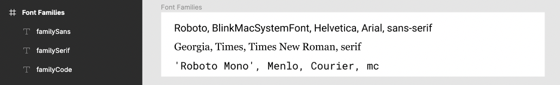

# Figmagic


[](https://sonarcloud.io/dashboard?id=mikaelvesavuori_figmagic)

[](https://codescene.io/projects/8364)

[](https://codescene.io/projects/8364)

[](https://codecov.io/gh/mikaelvesavuori/figmagic)

[](https://codeclimate.com/github/mikaelvesavuori/figmagic/maintainability)

<!-- ALL-CONTRIBUTORS-BADGE:START - Do not remove or modify this section -->

[](#contributors-)

<!-- ALL-CONTRIBUTORS-BADGE:END -->

> Figmagic é a peça perdida entre DevOps e design: Gerador de tokens de design, exporta gráficos, e extrai componentes React acionados por tokens para os seus documentos Figma.

🏕️ Kumbaya, amigos. Figmagic automatiza o mundo para um lugar melhor, mas não pode remover completamente designers e desenvolvedores: utomates the world into a better place, but does not attempt to completely remove designers or developers: O objetivo é apenas aproximar-se disso, enquanto eliminamos a maioria do trabalho tedioso que cresce em torno do desenvolvimento front-end.

_Construído inicialmente como uma ferramenta de transferência interna para [Humblebee](https://www.humblebee.se)._

---

## PS: A versão `4.3.0` introduz um novo tratamento de arquivos descartados/substituídos

Versões anteriores à 4.0 estão sendo usadas [`trash`](https://github.com/sindresorhus/trash) para lidar com arquivos que precisam ser substituídos. Na versão `4.3.0` esse não é mais o caso.

Quaisquer arquivos deletados, agora serão destruídos permanentemente pelo módulo ativo do Node `fs`.

**As versões `4.3.0` e `4.3.1` usam um modo duplo fragmentado, padrão configurável onde você pode usar um padrão "hard" ou "soft" de exclusão (exclusões sof significam substituir arquivos em uma pasta de lixeira local). _This is NOT supported and intended from `4.3.2` and forward as that was too buggy._**

---

## Requerimentos

**Por favor, perceba:** Figmagic requere que a sua estrutura de documento siga as convenções nesse documento; um setup inteiro pode ser visto nesse template em [https://www.figma.com/community/file/821094451476848226/Figmagic-%E2%80%94-Design-System-for-Tokens](https://www.figma.com/community/file/821094451476848226/Figmagic-%E2%80%94-Design-System-for-Tokens).

Figmagic é compilado do Typescript para ES6, então, você deve ter o Node 12 ou uma versão maior (Node 14 e mais novos são recomendados) para funcionar na sua máquina.

---

## Introdução

### Figmagic promove uma estrutura de montagem de design systems

Figmagic é uma ferramenta de linha de comando super flexível e muito simples que ajuda você a fazer bem três coisas:

#### 1. Output design tokens

Produzir e usar **design tokens** auxiliar em projetar com uma abordagem estruturada. Esses tokens são completamente agnósticos de plataforms quando produzidos em JSON, ou para a maiores dos desenvolvedores web, mais acessíveis de uso em vários sabores de Javascript (TS, JS, MJS). É web-orientada mas funciona bem com React Native também.

Uma configuração básica de tokens pareceria com:

```js
const tokens = {
  colors: {
    blue: 'rgba(20, 20, 255, 1)',
    warmWhite: 'rgba(240, 240, 240, 1)'
  },
  spacing: {
    small: '1rem',
    medium: '1.5rem'
  }
};
```

Você usar esses tokens dessa forma, `color: ${colors.blue};`, para formar e especificar os seus componentes codados, web sites, apps e o que você tiver, ao invés de código díficil para cada valor.

**Desse jeito, você dissocia a implementação de dados. Você pode agora facilmente dirigir as mudanças como _design choices_ através do Figma ao invés de _code changes_.**

#### 2. Output de gráficos

Diga adeus para sempre a exportar gráficos manualmente do Figma de novo. Pegue seus gráficos como PNG, SVG, como componentes React com SVG inline, ou como objetos que exportam todos os gŕaficos de um único arquivo.

#### 3. Gerando componentes React

Figmagic também permite a geração de componentes React de componentes Figma que seguem uma estrutura formal específica. É razoavelmente o melhor para componentes de baixo nível que você pode montar para fazer organismos mais complexos. Você pode ter uma rotatividade padrão e tempo de programação com o Figmagic.

E, não, o código não é uma droga! Essa era a minha maior queixa com serviços que prometem essa funcionalidade, então eu sabia que tinha que ser bom, ou pelo menos tolerável. Portanto, o Figmagic suporta coisas como usar seus próprios tokens (então nós podemos cortar o código pesado pro lixo, a menos que as correspondências não sejam encontradas) e você pode customizar completamente o número de arquivos relacionados gerados.

Enquanto não for perfeito, é definitivamente melhor que muitas coisas que eu já vi, feito por grandes companhias. Tudo isso é explicado mais tarde aqui na documentação.

#### Os argumentos

Aqui há algumas razões para você preferir o uso do Figmagic do que outra coisa similar:

- No Figmagic, design tokens são o conceito classe número um desde o primeiro dia
- Figmagic é orientado para o design, desde que o Figma é visto como fonte da verdade
- Figmagic é automatizável e bem leve (~45kb comprimidos), sem dependências externas
- Figmagic é amigável para desenvolvedores e faz algumas premissas no seu uso e/ou setup e suporta uma variedade de formatos de output maior que é expansível através de templates customizados se você precisar de algo completamente diferente
- Figmagic é open-source sobre a licença MIT e tem um longo histórico de pequenos ciclos de implementações para novas features/fixes
- Componentes React gerados se ligam a qualquer valor de token que você definir, então eles são igualmente úteis como código inicial ou qualquer código que você produza continuamente

## Fontes adicionais de documentação

As documentações do Figmagic para desenvolvedores são auto geradas a cada push e podem ser encontrados na [documentação dedicada ao site](https://docs.figmagic.com).

Para maiores informações sobre Elementos Figmagic e sincronização deles, veja [a página dedicada ao README](readme/elements.md).

## O ecossistema Figmagic

Em adição ao Figmagic, existem muitos outros repositórios/projetos que o cercam:

- [`figmagic-example`](https://github.com/mikaelvesavuori/figmagic-example): Esse repositório é uma demonstração do Figmagic. Nesse projeto você vai ver como um projeto rodando Webpack, React e Styled Components pode usar tokens. _Veja mais a seguir!_
- [`figmagic-action`](https://github.com/mikaelvesavuori/figmagic-action): Figmagic GitHub action. Use Figmagic para recuperar tokens, gráficos e/ou componentes React de um documento Figma.
- [`demo-figmagic-action`](https://github.com/mikaelvesavuori/demo-figmagic-action): Demonstração do GitHub action.
- [`figma-plugin-continuous-design`](https://github.com/mikaelvesavuori/figma-plugin-continuous-design): Continuous Design é um plugin do Figma que deixa você rodar GitHub Actions, Bitbucket Pipelines, and Azure DevOps Pipelines no Figma.
- [`automator-figmagic`](https://github.com/mikaelvesavuori/automator-figmagic): Mac OS X serviço automatizado para Figmagic.

### Projeto de exemplo

Um exemplo de projeto usando React, Styled Components e Storybook-está disponível em [https://github.com/mikaelvesavuori/figmagic-example](https://github.com/mikaelvesavuori/figmagic-example).

Note that this demo is not meant to fully style and do all of the things in the Figma document. I wanted to straddle a middle-of-the-road solution where I did the least work possible to get it working with React and style only a few of the most obvious and helpful elements, like setting disabled state on the button and checkbox.


_Figmagic Example Demo: Na esquerda é um grande componente Figma montado num número de "Elementos", o compilador de componentes do Figmagic pode ter um output no código. Na direita é uma versão de um componente React depois de alguns minutos de código e fechamento de elementos corretos._

## Usando Figmagic

### Instalação

#### Global (recomendado)

Rode `npm install -g figmagic` ou `yarn global add figmagic`.

#### Local

Uso local é possível instalando o Figmagic como uma dependência de desenvolvedor (debaixo de `devDependencies`) com `npm install figmagic -D` ou `yarn add figmagic -D`, então usando um script apontando para a versão local, como:

```
"scripts": {
  "figmagic": "npx figmagic"
}
```

### Criando um arquivo de configuração (`figmagic.json` ou `.figmagicrc`)

Figmagic pode ser rodado sem nenhuma configuração. Você sempre vai precisar expecificar sua API de token do Figma e seu documento de ID do Figma, no entanto! Apesar disso, é altamente recomendado adicionar uma configuração: é fácil e te dá uma tonelada de de possibilidades para otimizar suas necessidades.

Rode `figmagic init` para iniciar um arquivo de configuração básica, nomeie-o `figmagic.json` ou `.figmagicrc`. Contanto que você forneça seu token ou documentação ID/URL do Figma, o novo arquivo gerado está proto para ser usado pelo Element Sync que só pode ser feito se os seus pontos de configuração tiverem um código válido de geração de templates (é o que o gerado faz). Você verá que a configuração aponta de `templates.templatePath{Graphic|React|Styled|Storybook}` para `./node_modules/figmagic/templates/{graphic|react|styled|story}`. Leia mais em [Seção de arquivo de configuração](#configuration-file-figmagicrc).

### Rodando Figmagic

Primeiro de tudo, pegue o seu token da API e sua URL do Figma:

- Pegue o seu arquivo ID clicando com o botão direito na sua aba do Figma dentro do app e clique em `Copiar Link`—o primeiro, long junk-looking bit is the ID.
- Para mais sobre chaves de API, [vá para a documentação para desenvolvedores do Figma](https://www.figma.com/developers/docs).

Pass in your Figma API token and Figma URL by either:

- Stepping into your project directory (where you want Figmagic to run), and add or replace **FIGMA_URL** and **FIGMA_TOKEN** in a `.env` file with your own file ID (i.e. similar to `821094451476848226`) or full Figma URL (i.e. similar to `https://www.figma.com/file/821094451476848226/Figmagic-%E2%80%94-Design-System-template-4.0`) and API token key.
- Passing in API token and URL through the CLI, like this `figmagic --token {TOKEN} --url {URL}` (substitute curly braces for your actual values)
- Setting them in `figmagic.json`/`.figmagicrc` under `token` and `url`. This is discouraged since you will display these values in clear text and you probably don't want that.

Then:

- Run `figmagic`
- You should now have a folder with the raw JSON dump (default: `/.figmagic`) and a folder with tokens (default: `/tokens`) in the root

#### Pastas

Nomes de pastas seguem por padrão seus nomes. A renomeação é possível através de configuração.

- `.figmagic` vai conter o JSON extraído e recuperado da API do Figma
- `tokens` vai conter os arquivos de tokens
- `elements` vai conter os códigos gerados
- `graphics` vai conter gráficos

Para uma descrição mais completa da estrutura de código, veja a [seção de estrutura de código](#code-structure).

## Preparando Figma para uso do Figmagic

### Solução fácil: Copie o template de design system público do Figmagic para a Comunidade Figma

Vá para [https://www.figma.com/community/file/821094451476848226/Figmagic-%E2%80%94-Design-System-for-Tokens](https://www.figma.com/community/file/821094451476848226/Figmagic-%E2%80%94-Design-System-for-Tokens) e faça sua própria cópia. Vá em frente usando seu documento ID como a **FIGMA_URL** ou comece copiando em seu próprio trabalho.

### Solução menos fácil: Comece do scratch

Sua estrutura precisa seguir o seguinte:

- Uma página precisa existir, chamada `Design tokens`. Sem essa página, você não pode fazer muito com o Figmagic.
- Seguindo, dentro da página `Design tokens`, **frames** precisam existir. Você pode ter qualquer número de token frames suportado. Para iniciantes, nomeie eles como `Colors`, `Font sizes`, `Font families`, `Font weights`, `Line heights`, e `Spacing` – a cobertura exata não é importante, entretanto **spelling is important!** Para uma lista cheia de tipos de token, veja [os tipos de design tokens que o Figmagic pode extrair](#the-types-of-design-tokens-figmagic-can-extract).
- Todos os items em uma página precisam ser guardados por um ou mais frames.
- Quer sincronização de elementos? Então crie uma pagina "Elements" e coloque quaisquer componentes ali. Para a geração correta, você precisa ter os limites especificados.

Veja um template de design system em [https://www.figma.com/community/file/821094451476848226/Figmagic-%E2%80%94-Design-System-template-4.0](https://www.figma.com/community/file/821094451476848226/Figmagic-%E2%80%94-Design-System-template-4.0). Sinta-se livre para simplesmente copiar-colar ou basear seu trabalho através desse.

**Note:** Refer to the document structure in the image below and in the template linked above.


_How a Figmagic project could be structured in regards to tokens, if you want to support all currently available token types._

## O que são Design Tokens?

Design tokens são _**elementos abstratos e compartilhados**_ para que seu design system seja construído.

Design tokens _**expressam quaisquer um dos valores individuais que foram construídos para**_, como cores, espaçamentos, e features de tipografia.

Tokens oferecem uma forma de "contrato" entre as intenções dos designers e o cumprimento pelos desenvolvedores. Isso significa que os dois lados concordam em tratar suas partes individuais de um design completo através dos tokens, que representam esses valores. Como formato, eles são super fáceis de ler e entender e são adaptáveis para consumo por muitos tipos de sistemas ou aplicações. Isso é muito importante quando se começa com apps cross-platforms e coisas como isso.


Tokens garantem que os valores não são [números mágicos](<https://en.wikipedia.org/wiki/Magic_number_(programming)>) ou "apenas escolhidos aleatoriamente". Isso faz com que a comunicação seja precisa e sem esforço. Criar código para componente, mesmo complexos, pode ser muito menos chato, desde que o que você esteja fazendo esteja apontando para coisas como padding, z index, e qualquer outra coisa que os tokens possam representar.

_Portanto: Você pode continaur querendo adicionar um guia para uso. É apenas que os tokens deveriam ser capazes de serem consumidos sem entender nada específico sobre eles._

Você deve vincular os tokens aos estilos do Figma quando e onde for possível para simplificar o seu trabalho de design, mas tenha certeza que isso também está representado na página de **Tokens** , já que nessa página que um desenvolvedor irá pegar os tokens com o Figmagic.

### Os tipos de design tokens que o Figmagic pode extrair

Atualmente você pode extrair design tokens de:

- Cores (incluindo lineares e gradientes radiais, note que: gradientes lineares que não usam ângulos retos vão ter um cálculo incorreto)
- Tamanhos de fontes
- Espaçamento
- Peso de Fontes
- Altura das linhas
- Famílias de fontes
- Espaçamento entre letras
- Z index
- Radii
- Tamanhos de bordas
- Sombras (atualmente suporta únicos/mútiplos Drop Shadows, see caveat below)
- Opacidades
- Durações (para animações)
- Delays (para animações)
- Easing functions (para animações)
- Media Queries

Um típico caso de uso para documentos gerados é alimentar os valores extraídos do sistema de CSS que suporta valores externos (como Styled Componentes, Emotion, Styled System, e quaisquer outras CSS-in-JS bibliotecas, ou até talvez Sass).

#### Note on shadows

De [alehar9320](https://github.com/alehar9320) comentado na [issue 111](https://github.com/mikaelvesavuori/figmagic/issues/111):

> Figma calls everything Drop-shadow, while translating the design into box-shadow or drop-shadow CSS dependent upon whether it's a ~ shape or a vector graphic. See [blog post](https://www.figma.com/blog/behind-the-feature-shadow-spread/) from the Figma developer who built the feature.

> This means that if Figmagic is used to define shadow tokens, it should be recommended to only have one drop-shadow definition per rectangle. To maintain compatibility with both drop-shadow and box-shadow CSS. The exception would be if there is a clear distinction between tokens to be used with box-shadow and drop-shadow. As [_drop-shadow_ can only accept a single shadow parameter](<https://developer.mozilla.org/en-US/docs/Web/CSS/filter-function/drop-shadow()>). Any token that has two values will simply be incompatible with drop-shadow.

## Trabalhando com o Figmagic como designer

### Estilos do Figma

Estilos do Figma se tornaram disponíveis públicos em Junho de 2018 e estão disponíveis para designers criarem single-sources-of-truth quando começarem com valores de design (tokens). Quando se está usando o Figmagic no entenado, o pensamento e usabilidade é um pouco diferente de como os estilos do Figma funcionam.

#### Valores unidimensionais ou multidimensionais

Um estilo do figma é multidimensional: contém um número de propriedades envolto em um estilo, agindo como uma espécie de pacote. Isso é acessível num desenvolvimento de design e é prático para pontos de vista dos usuários. O usuário não precisa pensar muito sobre valores de armazenamento "redundante" que são o mesmo em outros componentes, como N números de unidades para altura de linhas: Eles são todos muito cuidadosos.

O Figmagic expressa os tokens como instâncias de cada valor individual portanto sendo _unidimensional_ - significa que eles armazenam apenas um valor por item. Exemplos podem ser setados em alturas de linhas, peso de fontes ou tamanhos de fontes, cada um é especificado individualmente. O que isso envolve para o desenvolvedor e o designer, é que valores podem ser usados e misturados em vários contextos, não ficando preso a um contexto específico como um cabeçalho. Para um desenvolvedor, isso é bom porque nós preferimos mapear os valores definitivos para algo, para um componente (um "contexto" por assim dizer).

Por causa dessa diferença, o jeito apropriado de estruturar o Figmagic-documento de design compatível com o Figma é mostrar um ou mais items/tokens nos respectivos frames que correspondem aos tipos de tokens aceitos (altura de linha, tamanho da fonte...) onde cada item tem um tipo de propriedade chave que é mudada entre elas (como um texto usando tamanho 58, outro usando tamanho 40), desde que esses items sejam loops do Figmagic quando criados novos códigos de tokens.

Um dos maiores desvios do principal são as "Fontes" onde você pode especificar mais propriedades que uma. Entretanto, elas precisam corresponder individualmente a outros tokens tipográficos que você possar ter, como altura de linhas.


_The "Heading L" font token is composed of values that are also represented in the "lesser" uni-dimensional tokens: displayed here are "Line Height S" (135% line height), "H1" (size 48), and "Font Bold" (Bold font style). Setting this font as a Figma Style will make your life as a designer much easier as your apply the text style to things. Auto-generating code with Figmagic will also work just fine, since the individual values are respected._

#### OK, mas eu deveria usar os estilos do Figma enquanto uso o Figmagic?

O que for melhor para você! Com tanto que você lembra que o Figmagic busca aqueles valores (unidimensionais) para cada design items/tokens tudo deverá funcionar. Eu já vi estilos do Figma que fazem um "contrato" entre tokens e seus espaços de trabalho do dia-a-dia com designers muito mais fácil. De novo portanto, Figmagic não usa esses valores; pense neles como uma cola conveniente.

## Configurando Figmagic

### Sincronizar Token

**Por padrão está ligado. Você vai precisar ter uma pagina de nome "Design tokens", onde com os seus tokens frames nomeados.**

Tokens são o "pão e a manteiga" of Figmagic. Sem tokens, Figmagic não pode criar elementos. E mesmo sem elementos, os tokens fornecem toda a experiência para ajudar você com um design system compentente e sem código.

No caso de você querer pular para um frame dado, você pode adicionar um sublinhado principal ao nome do frame. Você também pode pular items individuais nomeando-os com `ignore` ou adicionando um sublinhado principal.

Isso é ativado por padrão, mas agora é possível desativar se você tem razões bem específicas para.

### Sincronizar Gráficos

**Por padrão isso está desligado. Passe `--syncGraphics` como uma flag para sincroniza-los ou habilita-los no seu arquivo de configuração. Você vai precisar ter uma página com o nome "Graphics", onde seus componentes serão adicionados diretamente.**

Gráficos podem ser exportados em múltiplos formatos com o Figmagic. Ao inveś de fazer a entrega manual, apenas diga aos desenvolvedores que tiveram atualizações aos gráficos e deixem eles darem um pull as últimas versões do documento do Figma.

Novamenteo, dê uma olhada no template em [https://www.figma.com/community/file/821094451476848226/Figmagic-%E2%80%94-Design-System-for-Tokens](https://www.figma.com/community/file/821094451476848226/Figmagic-%E2%80%94-Design-System-for-Tokens) para referência.

### Sincronizar Elementos

**Isso também fica desligado por padrão. Passe `--syncElements` ou ative no seu arquivo de configuração para gerar código para os seus componentes Figma.**

_Upcoming versions of Figmagic may attempt to support [Figma Variants](https://help.figma.com/hc/en-us/articles/360055471353-Prepare-for-Variants), but that will have to be publicly released first, and then vetted against what Figmagic can generate before I commit to supporting that model. Until then, the existing mental model of "Elements" will continue to be used._

Elementos são nomeados porque são destinados principalmente a ajduar na programação que mapeia por padrão elementos HTML como input, button, h1, e form. Com programação nós queremos dizer esses elementos que podem ser gerados como código num formato que preenche para continuaçao do desenvolvimento. Elementos podem ser um bom ponto de entrar para ambos, design e geração de código, desde que eles sejam relativamente simples como conceitos mapeados no HTML, o que retorna o embasamento em tags ("elementos").

Elementos são gerados passando sua estrutura de componentes do Figma em qualquer variedade "flat" ou "nested". Quaisquer valores, diremos uma altura de 48px e uma cor específica azul, vai tentar ser entregue como derivada de um token relevante. **Portanto, sem tokens, elementos não podem ser gerados!** Nesse exemplo, talvez a altura vá ser mapeada por um token que usa 48px (mapeada como `3rem` onde 3 x 16 = 48, com 16 sendo o valor padrão de REM) e a cor poderia ser mapeada como cor nos tokens de cores.

_If you need more information and guidance on this, see the dedicated documentation section at [Figmagic Element Sync](images/elements.md)._

### Como configurações de usuário são propagadas

Há muitas formas com as quais você pode fornecer o Figmagic com conhecimento sobre como você passará seus tokens.
Você pode combinar eles, mas cuidado com a priorização do gráfico (do menor para o maior):

1. Configurações fornecidas pelo usuário pelo arquivo `figmagic.json`/`.figmagicrc`
2. Variavéis de desenvolvimento (também carregadas no arquivo `.env`)
3. Argumentos de linhas de comando e flags

Se possível, fixe um jeito de providenciar as confiurações.

Valores não providenciados vão voltar para os padrões em `bin/entities/Config/baseConfig.ts`.

### Arquivos de configuração (`figmagic.json` ou `.figmagicrc`)

Você pode usar um JSON formatado como arquivo de configuração na raíz do projeto para usar as configurações. Figmagic vai pegar pelo caminho avaliando o trabalho atual no diretório e olhando também para os arquivos `figmagic.json` ou `.figmagicrc` . Se achá-los, vai usá-los.

Um exemplo de arquivo é fornecido no Figmagic-você pode encontrar na raíz do projeto. O arquivo se chama `figmagicrc`, apenas adicione o ponto principal e coloque o arquivo na pasta do seu próprio projeto para usar. Para usar como JSON, adicione `json` no final do arquivo.

Como é um arquivo de configuração, você precisa ser cuidadoso em escrever corretamente ou você pode terminar com falhas e erros.

Abaixo está um conjunto completo do que você pode configurar, junto com os padrões.

```json5
{
  "debugMode": false,
  "fontUnit": "rem",
  "letterSpacingUnit": "em",
  "lineHeightUnit": "unitless",
  "opacitiesUnit": "float",
  "figmaData": "figma.json",
  "figmagicFolder": ".figmagic",
  "outputFolderElements": "elements",
  "outputFolderGraphics": "graphics",
  "outputFolderTokens": "tokens",
  "outputFormatColors": "rgba",
  "outputFormatCss": "ts",
  "outputFormatDescription": "md",
  "outputFormatElements": "tsx",
  "outputFormatGraphics": "svg",
  "outputFormatStorybook": "js",
  "outputFormatTokens": "ts",
  "outputGraphicElements": false,
  "outputGraphicElementsMap": false,
  "outputScaleGraphics": 1,
  "outputDataTypeToken": null,
  "overwrite": {
    "css": false,
    "description": false,
    "graphic": false,
    "react": false,
    "storybook": false,
    "styled": false
  },
  "recompileLocal": false,
  "refreshType": "soft",
  "remSize": 16,
  "skipFileGeneration": {
    "forceUpdate": true,
    "skipCss": false,
    "skipDescription": false,
    "skipReact": false,
    "skipStorybook": false,
    "skipStyled": false
  },
  "spacingUnit": "rem",
  "syncElements": false,
  "syncGraphics": false,
  "syncTokens": true,
  "templates": {
    "templatePathGraphic": "templates/graphic",
    "templatePathReact": "templates/react",
    "templatePathStorybook": "templates/story",
    "templatePathStyled": "templates/styled"
  },
  "token": "",
  "unitlessPrecision": 2,
  "url": "",
  "usePostscriptFontNames": false,
  "versionName": null
};
```

### Argumentos CLI

Rode esses comandos no ambiente de linha de comando a sua escolha.

---

#### Toggle debug mode

`figmagic [--debug | -d]`

**Default**: `false`.

---

#### Switch font unit

`figmagic [--fontUnit | -fu] [rem|em|px]`

**Default**: `rem`.

---

#### Switch letter-spacing unit

`figmagic [--letterSpacingUnit | -lsu] [em|px]`

**Default**: `em`.

---

#### Switch line-height unit

`figmagic [--lineHeightUnit | -lhu] [unitless|em|px|rem]`

**Default**: `unitless`.

---

#### Switch opacities unit

`figmagic [--opacitiesUnit | -ou] [float|percent]`

**Default**: `float`.

---

#### Set output file name

`figmagic [--figmaData | -file] [filename]`

**Default**: `figma.json`.

---

#### Set Figma base file output folder

`figmagic [--figmagicFolder | -base] [folder]`

**Default**: `.figmagic`.

---

#### Set elements output folder

`figmagic [--outputFolderElements | -elements] [folder]`

**Default**: `elements`.

---

#### Set graphics output folder

`figmagic [--outputFolderGraphics | -graphics] [folder]`

**Default**: `graphics`.

---

#### Set token output folder

`figmagic [--outputFolderTokens | -tokens] [folder]`

**Default**: `tokens`.

---

#### Switch color format

`figmagic [--outputFormatColors | -fcol] [hex|rgba]`

**Default**: `rgba`.

Isso apenas de aplica a cores sólidas; gradientes vão continuar usando cores RGBA.

Hex color support may potentially interfere with element generation and binding to tokens, since RGB(A) is the format that Figma itself uses, so there is a slight possibility of mismatches in the Figmagic binding process.

_Note that hex colors will not use any alpha/transparency!_

---

#### Switch CSS file format

`figmagic [--outputFormatCss | -fc] [ts|mjs|js]`

**Default**: `ts`.

---

#### Switch description file format

`figmagic [--outputFormatDesc | -fd] [md|txt]`

**Default**: `md`.

---

#### Switch elements file format

`figmagic [--outputFormatElements | -fe] [tsx|jsx|mjs|js]`

**Default**: `tsx`.

---

#### Switch graphics file format

`figmagic [--outputFormatGraphics | -fg] [svg|png]`

**Default**: `svg`.

---

#### Switch Storybook file format

`figmagic [--outputFormatStorybook | -fs] [ts|js|mdx]`

**Default**: `js`.

---

#### Switch token file format

`figmagic [--outputFormatTokens | -ft] [ts|mjs|js|json|css]`

**Default**: `ts`.

---

#### Output graphics as wrapped React elements

`figmagic [--outputGraphicElements | -oge]`

**Default**: `false`.

---

#### Output graphics elements map

`figmagic [--outputGraphicElementsMap | -ogm]`

**Default**: `false`.

---

#### Set output scale of graphics

`figmagic [--outputScaleGraphics | -scale] [number]`

**Default**: `1`.

_Note that from the CLI you must specify the scale size like `3x` (or anything at the end, as long as it includes a letter at the end). This only applies to CLI configuration, and does not apply to other types of config, such as through `figmagic.json` or `.figmagicrc`_.

---

#### Set output token data type

`figmagic [--outputDataTypeToken | -tokentype] [null | enum]`

**Default**: `null`.

---

#### Overwrite files

This is not currently possible to adjust from the CLI.

---

#### Recompile data from local Figma JSON file

`figmagic [--recompileLocal | -local]`

**Default**: `null`, and will then be taken from local `.env` file if not explicitly passed in through the CLI.

---

#### Set REM size

`figmagic [--remSize | -rem] [number]`

**Default**: `16`.

_Note that from the CLI you must specify the REM size like `16p` (or anything at the end, as long as it includes a letter at the end). This only applies to CLI configuration, and does not apply to other types of config, such as through `figmagic.json` or `.figmagicrc`_.

---

#### Force update all elements

`figmagic [--forceUpdate | -force]`

**Default**: `true`.

Forces all elements and file types to be regenerated.

---

#### Skip file generation: CSS

`figmagic [--skipCss | -nocss]`

**Default**: `false`.

Skip creating CSS file when syncing elements.

---

#### Skip file generation: Markdown description

`figmagic [--skipDescription | -nodesc]`

**Default**: `false`.

Skip creating Markdown file when syncing elements.

---

#### Skip file generation: React

`figmagic [--skipReact | -noreact]`

**Default**: `false`.

Skip creating React file when syncing elements.

---

#### Skip file generation: Storybook

`figmagic [--skipStorybook | -nostory]`

**Default**: `false`.

Skip creating Storybook file when syncing elements.

---

#### Skip file generation: Styled Components

`figmagic [--skipStyled | -nostyled]`

**Default**: `false`.

Skip creating Styled Components file when syncing elements.

---

#### Switch spacing unit

`figmagic [--spacingUnit | -s] [rem|em|px]`

**Default**: `rem`.

---

#### Sync elements

`figmagic [--syncElements | -se]`

**Default**: `false`, and will then be taken from local `.env` file if not explicitly passed in through the CLI.

Use this when you want to sync elements in your "Elements" page in Figma.

---

#### Sync graphics

`figmagic [--syncGraphics | -sg]`

**Default**: `false`, and will then be taken from local `.env` file if not explicitly passed in through the CLI.

Use this when you want to sync graphics in your "Graphics" page in Figma. Use the RC configuration file to pass in options. Default format will be SVG.

---

#### Sync tokens

`figmagic [--syncTokens | -st]`

**Default**: `true`, and will then be taken from local `.env` file if not explicitly passed in through the CLI.

Use this when you want to sync tokens in your "Design tokens" page in Figma. Use the RC configuration file to pass in options.

---

#### Set path to graphics template

`figmagic [--templatePathGraphic | -tpgraphic] [path]`

**Default**: `templates/graphic`.

_Your local `figmagic.json` or `.figmagicrc` file must have a block with `templates.templatePathGraphic` that specifies a valid path, such as `./node_modules/figmagic/templates/graphic`_.

---

#### Set path to React template

`figmagic [--templatePathReact | -tpreact] [path]`

**Default**: `templates/react`.

_Your local `figmagic.json` or `.figmagicrc` file must have a block with `templates.templatePathReact` that specifies a valid path, such as `./node_modules/figmagic/templates/react`_.

---

#### Set path to Storybook template

`figmagic [--templatePathStorybook | -tpstory] [path]`

**Default**: `templates/story`.

_Your local `figmagic.json` or `.figmagicrc` file must have a block with `templates.templatePathStory` that specifies a valid path, such as `./node_modules/figmagic/templates/story`_.

---

#### Set path to Styled Components template

`figmagic [--templatePathStyled | -tpstyled] [path]`

**Default**: `templates/styled`.

_Your local `figmagic.json` or `.figmagicrc` file must have a block with `templates.templatePathStyled` that specifies a valid path, such as `./node_modules/figmagic/templates/styled`_.

---

#### Pass in Figma API token

`figmagic [--token | -t] [token]`

**Default**: `null`, and will then be taken from local `.env` file if not explicitly passed in through the CLI.

---

#### Set relative import path for tokens (for CSS)

`figmagic [--tokensRelativeImportPrefix | -tip] [path]`

**Default**: `''` (effectively just blank or the same folder). Use this so CSS files can import tokens from the correct location, for example to resolve something like `../../tokens/colors.ts` you would pass in `../../` and `tokens` would be whatever your `outputFolderTokens` value is.

---

#### Pass in Figma URL

`figmagic [--url | -u] [url_id]`

**Default**: `null`, and will then be taken from local `.env` file if not explicitly passed in through the CLI.

---

#### Pass in unitless precision

`figmagic [--unitlessPrecision | -up] [number]`

**Default**: `2`.

Defines the precision (decimals) for unitless values (rounded using `.toFixed()` internally).

---

#### Set font family name to be Postscript name instead of "common name"

`figmagic [--usePostscriptFontNames | -ps]`

**Default**: `false`, i.e. common name.

---

#### Set font families tokens based on the content rather on the font applied to the Figma's frame

`figmagic [--useLiteralFontFamilies | -lff]`

**Default**: `false`, i.e. uses common name or Postscript name applied to the Figma's frame.

That's particularly useful for defining the whole font family stack with the fallbacks instead of a single font name, i.e.: `Roboto, BlinkMacSystemFont, Helvetica, Arial, sans-serif`



---

#### Use a versioned Figma document

`figmagic [--versionName | -v]`

**Default**: `null` which will resolve to the latest version. The value you specify here is the name of the version in the Figma file's **Version history**.

---

## Color themes support

From version `4.5.8`, you can also export color themes tokens.

Consider the following example in Figma, as example of an app that allows the user to switch between Dark Theme and Light Themes for enhancing accessibility:


It will translate into the following generated tokens:

```js
const colors = {
  black: 'rgba(51, 51, 51, 1)',
  white: 'rgba(255, 255, 255, 1)',
  red: 'rgba(235, 87, 87, 1)',
  blue8: 'rgba(47, 128, 237, 1)',
  green6: 'rgba(33, 150, 83, 1)',
  darkTheme: {
    emptyShade: 'rgba(51, 51, 51, 1)',
    fullShade: 'rgba(255, 255, 255, 1)',
    mediumShade: 'rgba(189, 189, 189, 1)',
    darkShade: 'rgba(224, 224, 224, 1)',
    danger: 'rgba(248, 102, 102, 1)',
    warning: 'rgba(246, 212, 107, 1)',
    primary: 'rgba(39, 131, 255, 1)',
    success: 'rgba(68, 239, 141, 1)'
  },
  lightTheme: {
    fullShade: 'rgba(51, 51, 51, 1)',
    emptyShade: 'rgba(255, 255, 255, 1)',
    darkShade: 'rgba(130, 130, 130, 1)',
    mediumShade: 'rgba(189, 189, 189, 1)',
    danger: 'rgba(235, 87, 87, 1)',
    warning: 'rgba(242, 201, 76, 1)',
    primary: 'rgba(47, 128, 237, 1)',
    success: 'rgba(33, 150, 83, 1)'
  }
};
```

Which in a practical example you could use as follows:

```js

// initialize with default theme
let theme = 'lightTheme';

// Primary action button with white color token and with different primary background color according to the theme
let button = `<button style="background: ${colors[theme].primary}; color: ${colors.white}">Primary Action</button>`;

// Background color that changes according to the theme
let panel = `<div style=`color: ${colors[theme].emptyShade}`>Panel background</div>`
```

**Note on Components generation**

Please note that component generation using the `--syncElements` options doesn't support color tokens yet. In case you have a component with a color that only exists on the `colors -> color theme frame` Figmagic will warn about: "No matching token! Hard-coding to expected value". Which means, that the component will still be created, just without a token assigned to it the color, since it currently only looks for the Colors frame and not for nested frames.

---

## Templates used for code generation

Starting with Figmagic version 4.0, four types of generated files have customizable templates:

- Graphic elements
- React elements
- Storybook files
- Styled Components (React) files

These four types have support for a variety of formats that differ a bit between each type.

Figmagic comes with a set of templates for several file formats. In case you want to customize these, you should respect and keep any substitution tags that exist in the original files; removing them may cause your templates to function incorrectly. For example, the React template includes a substitution tag called `{{NAME_STYLED}}` which will be changed to your adjusted element name with a "Styled" suffix. Removing it would make your generated code useless as-is.

The recommended way of adding and using your own templates would be to copy-paste any/all existing templates from Figmagic into your project, pointing the configuration file to your local copies, and then modifying them as needed.

## Token formatting and conversions

### Font families

The font family name, either as its common name (as picked up by Figma; spaces are removed) or its Postscript name (eg. FiraSans-Regular).

**Default:** Common name.

**Note**: In previous versions of Figmagic the Postscript font family name was used.

---

### Font weights

Typical font weight values like `200`, `300` etc.

---

### Font sizes

Units based on global font size (base 16px).

**Default:** `rem` units. Can be set to `rem` or `em`.

---

### Line heights

Unitless.

2 decimals numbered values by default. Precision can be configured with `unitlessPrecision` (see config)

---

### Colors

**Default:** `rgba`. Can be set to `rgba` or `hex`.

---

### Spacing

**Default:** `rem` units. Can be set to `rem` or `em`.

---

### Border widths

**Default:** `px` units.

---

### Letter spacings

**Default:** `em` units.

---

### Media queries

**Default:** `px` units.

---

### Opacities

Typical 2 decimals numbered values between 0 and 1 like `0` or `0.65`.
Can be set to `percent` to have them converted to `%` strings instead like `0%` or `65%`.

---

### Radii

**Default:** `px` units.

---

### Shadows

**Default:** `px` units for three values (horizontal offset, vertical offset, blur) and RGBA for the color.

---

### Z indices

**Default:** numbers (whole numbers, i.e. integers).

---

## Code structure

### Figmagic source code structure

| Folder            | Description                                                                                                                                                           |
| ----------------- | --------------------------------------------------------------------------------------------------------------------------------------------------------------------- |
| `__tests__/`      | Tests, structured similarly to the `bin` folder source code                                                                                                           |
| `.github/`        | GitHub files for CI and issue template                                                                                                                                |
| `.husky/`         | Husky pre-commit configuration                                                                                                                                        |
| `.vscode/`        | Visual Studio Code configuration                                                                                                                                      |
| `bin/`            | Source code                                                                                                                                                           |
| `bin/contracts`   | Types and interfaces                                                                                                                                                  |
| `bin/controllers` | Controllers                                                                                                                                                           |
| `bin/entities`    | Entities (DDD-style), this is where most of the logic will be contained                                                                                               |
| `bin/frameworks`  | Non-domain functionality, like string manipulation and downloading files etc.                                                                                         |
| `bin/usecases`    | Where the application "features" are orchestrated, as per [Clean Architecture](https://blog.cleancoder.com/uncle-bob/2012/08/13/the-clean-architecture.html)          |
| `build/`          | ES6-compiled code (this is the code that consumers of the Figmagic binary actually use)                                                                               |
| `images/`         | Documentation, mostly images and screen shots. You can manually generate the Arkit diagram with `npm run docs`.                                                       |
| `readme/`         | Additional readme files                                                                                                                                               |
| `templates/`      | Files that are used as templates for code generation                                                                                                                  |
| `testdata/`       | Most of the tests point to stored test data which is stored in this folder                                                                                            |
| `typedoc-docs/`   | Documentation generated by TypeDoc, which gets hosted at [https://docs.figmagic.com](https://docs.figmagic.com). You can manually generate these with `npm run docs`. |
| `index.ts`        | The file that initializes and sets up everything required to run Figmagic                                                                                             |

### Arkit diagram

This is how [Arkit](https://arkit.pro) models Figmagic and its source code structure and dependencies. Note that this diagram omits frameworks, external dependencies and contracts (i.e. types) to focus on the primary flows.

**Note!** Only visible on the [documentation site](https://docs.figmagic.com).


## License

Figmagic is licensed under the [MIT License](https://opensource.org/licenses/MIT).

It uses a number of developer dependencies under various open source licenses, but none of these are bundled into the actual binary that users consume as Figmagic itself has no end-user-facing dependencies.

```
Copyright 2018-2023 Mikael Vesavuori

Permission is hereby granted, free of charge, to any person obtaining a copy of this software and associated documentation files (the "Software"), to deal in the Software without restriction, including without limitation the rights to use, copy, modify, merge, publish, distribute, sublicense, and/or sell copies of the Software, and to permit persons to whom the Software is furnished to do so, subject to the following conditions:

The above copyright notice and this permission notice shall be included in all copies or substantial portions of the Software.

THE SOFTWARE IS PROVIDED "AS IS", WITHOUT WARRANTY OF ANY KIND, EXPRESS OR IMPLIED, INCLUDING BUT NOT LIMITED TO THE WARRANTIES OF MERCHANTABILITY, FITNESS FOR A PARTICULAR PURPOSE AND NONINFRINGEMENT. IN NO EVENT SHALL THE AUTHORS OR COPYRIGHT HOLDERS BE LIABLE FOR ANY CLAIM, DAMAGES OR OTHER LIABILITY, WHETHER IN AN ACTION OF CONTRACT, TORT OR OTHERWISE, ARISING FROM, OUT OF OR IN CONNECTION WITH THE SOFTWARE OR THE USE OR OTHER DEALINGS IN THE SOFTWARE.
```

## Contribution

### Want to add or rethink something in Figmagic?

You are welcome to contribute to the project! Pull requests, as well as issues or plain messages, work fine. For pull requests, please refer to the contribution guidelines in [`CONTRIBUTING.md`](CONTRIBUTING.md).

## Contributors ✨

Thanks goes to these wonderful people ([emoji key](https://allcontributors.org/docs/en/emoji-key)):

<!-- ALL-CONTRIBUTORS-LIST:START - Do not remove or modify this section -->
<!-- prettier-ignore-start -->
<!-- markdownlint-disable -->
<table>
  <tr>
    <td align="center"><a href="https://floschild.me"><br /><sub><b>Florent SCHILDKNECHT</b></sub></a><br /><a href="https://github.com/mikaelvesavuori/figmagic/commits?author=flo-sch" title="Code">💻</a></td>
    <td align="center"><a href="https://www.linkedin.com/in/paulohenriquesilva/"><br /><sub><b>Paulo Henrique</b></sub></a><br /><a href="https://github.com/mikaelvesavuori/figmagic/commits?author=opauloh" title="Code">💻</a></td>
    <td align="center"><a href="http://peeja.com/"><br /><sub><b>Petra Jaros</b></sub></a><br /><a href="https://github.com/mikaelvesavuori/figmagic/commits?author=Peeja" title="Code">💻</a></td>
    <td align="center"><a href="https://github.com/markomarkom"><br /><sub><b>Marko Marković</b></sub></a><br /><a href="https://github.com/mikaelvesavuori/figmagic/commits?author=markomarkom" title="Code">💻</a></td>
    <td align="center"><a href="https://github.com/mykhailoInnovecs"><br /><sub><b>mykhailoInnovecs</b></sub></a><br /><a href="https://github.com/mikaelvesavuori/figmagic/commits?author=mykhailoInnovecs" title="Code">💻</a></td>
    <td align="center"><a href="https://www.haikuforteams.com/"><br /><sub><b>Zack Brown</b></sub></a><br /><a href="https://github.com/mikaelvesavuori/figmagic/commits?author=zackbrown" title="Code">💻</a></td>
    <td align="center"><a href="https://muffinman.io/"><br /><sub><b>Stanko Tadić</b></sub></a><br /><a href="https://github.com/mikaelvesavuori/figmagic/commits?author=Stanko" title="Code">💻</a></td>
    <tr>
     <td align="center"><a href="https://github.com/Ishmam156"><br /><sub><b>Ishmam Chowdhury</b></sub></a><br /><a href="https://github.com/mikaelvesavuori/figmagic/commits?author=Ishmam156" title="Code">💻</a></td>
   </tr>
  </tr>
</table>

<!-- markdownlint-restore -->
<!-- prettier-ignore-end -->

<!-- ALL-CONTRIBUTORS-LIST:END -->

This project follows the [all-contributors](https://github.com/all-contributors/all-contributors) specification. Contributions of any kind welcome!
